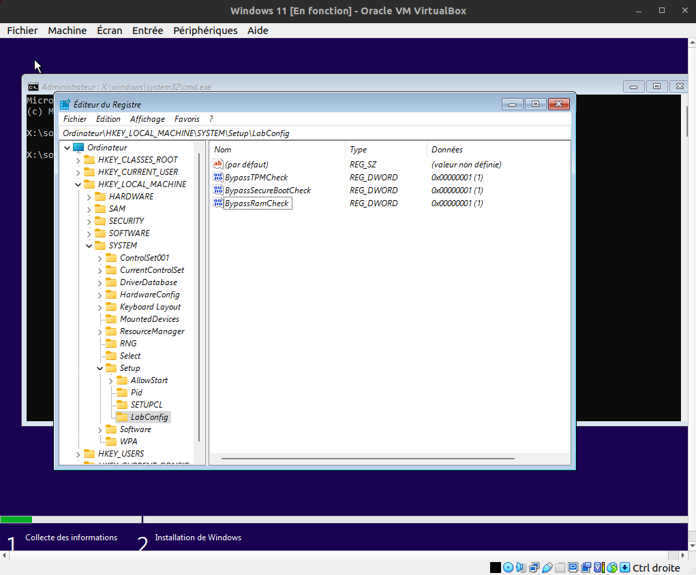

# Installation et configuration de VirtualBox, de machines virtuel et de systèmes d'exploitation

<a href="https://florobart.github.io/Documentations/"><button type="button">Retour à toute les documentations</button></a>

## Règles

- "`Saisie utilisateur`"
- '`Elément cliquable/sélectionnable`'
- `Nom de fichier, dossier ou autre`
- <Élément à remplacer>

> lien, raccourci clavier et phrase de demande de saisie

```txt
commande, extrait code et extrait de fichier
```

<div style="page-break-after: always;"></div>

## Table des matières

****

- [Installation et configuration de VirtualBox, de machines virtuel et de systèmes d'exploitation](#installation-et-configuration-de-virtualbox-de-machines-virtuel-et-de-systèmes-dexploitation)
  - [Règles](#règles)
  - [Table des matières](#table-des-matières)
  - [Installation de VirtualBox en ajoutant le fichier deb dans le gestionnaire de paquets `apt`](#installation-de-virtualbox-en-ajoutant-le-fichier-deb-dans-le-gestionnaire-de-paquets-apt)
  - [Installation en téléchargeant le fichier deb](#installation-en-téléchargeant-le-fichier-deb)
  - [Création d'une machine virtuel Ubuntu desktop dans VirtualBox](#création-dune-machine-virtuel-ubuntu-desktop-dans-virtualbox)
    - [Création de la machine virtuel](#création-de-la-machine-virtuel)
    - [Création du profil utilisateur](#création-du-profil-utilisateur)
    - [Configuration matériel de la machine virtuel](#configuration-matériel-de-la-machine-virtuel)
    - [Installer les additions invités après l'installation de la VM](#installer-les-additions-invités-après-linstallation-de-la-vm)
    - [Activer le copier coller entre l'hôte et la VM](#activer-le-copier-coller-entre-lhôte-et-la-vm)
  - [Création d'une machine virtuel Windows 11](#création-dune-machine-virtuel-windows-11)
    - [Création de la machine virtuel Windows 11](#création-de-la-machine-virtuel-windows-11)
    - [Configuration matériel de la machine virtuel Windows 11](#configuration-matériel-de-la-machine-virtuel-windows-11)
    - [Installation et configuration de Windows 10/11](#installation-et-configuration-de-windows-1011)
    - [Installer les additions invités après l'installation de la VM Windows 11](#installer-les-additions-invités-après-linstallation-de-la-vm-windows-11)
    - [Activer le copier coller entre l'hôte et la VM Windows 11](#activer-le-copier-coller-entre-lhôte-et-la-vm-windows-11)
  - [Création d'une machine virtuel MacOS Ventura](#création-dune-machine-virtuel-macos-ventura)
    - [Création de la machine virtuel MacOS Ventura](#création-de-la-machine-virtuel-macos-ventura)
    - [Configuration matériel de la machine virtuel MacOS Ventura](#configuration-matériel-de-la-machine-virtuel-macos-ventura)
  - [Création d'une machine virtuel Mac OS X Mountain Lion](#création-dune-machine-virtuel-mac-os-x-mountain-lion)
    - [Création de la machine virtuel Mac OS X Mountain Lion](#création-de-la-machine-virtuel-mac-os-x-mountain-lion)
    - [Configuration matériel de la machine virtuel Mac OS X Mountain Lion](#configuration-matériel-de-la-machine-virtuel-mac-os-x-mountain-lion)
  - [Création d'une machine virtuel Ubuntu server 16.04](#création-dune-machine-virtuel-ubuntu-server-1604)
    - [Création de la machine virtuel Ubuntu server 16.04](#création-de-la-machine-virtuel-ubuntu-server-1604)
    - [Pré-configuration du système d'exploitation (si vous n'avez pas cocher la case '`Skip Unattended Installation`' uniquement)](#pré-configuration-du-système-dexploitation-si-vous-navez-pas-cocher-la-case-skip-unattended-installation-uniquement)
    - [Configuration matériel de la machine virtuel Ubuntu server 16.04](#configuration-matériel-de-la-machine-virtuel-ubuntu-server-1604)
    - [configuration logiciel de Ubuntu server 16.04 (si vous avez cocher la case '`Skip Unattended Installation`' uniquement)](#configuration-logiciel-de-ubuntu-server-1604-si-vous-avez-cocher-la-case-skip-unattended-installation-uniquement)
    - [Instruction tirer de l'installation échoué de Ubuntu server 22.04 sur une machine physique](#instruction-tirer-de-linstallation-échoué-de-ubuntu-server-2204-sur-une-machine-physique)
      - [Configurer la connexion réseau](#configurer-la-connexion-réseau)
      - [Connexion au réseau (Wifi)](#connexion-au-réseau-wifi)
      - [Suite de la configuration](#suite-de-la-configuration)
      - [Création de l'utilisateur](#création-de-lutilisateur)
      - [Configuration SSH](#configuration-ssh)
  - [Création d'une machine virtuel Debian 12](#création-dune-machine-virtuel-debian-12)
    - [Création de la machine virtuel Debian 12](#création-de-la-machine-virtuel-debian-12)
    - [Configuration matériel de la machine virtuel Debian 12](#configuration-matériel-de-la-machine-virtuel-debian-12)
      - [Configuration du processeur, de la mémoire RAM et du BIOS](#configuration-du-processeur-de-la-mémoire-ram-et-du-bios)
      - [Configuration du disque dur](#configuration-du-disque-dur)
    - [configuration logiciel de Debian 12 (si vous avez cocher la case '`Skip Unattended Installation`' uniquement)](#configuration-logiciel-de-debian-12-si-vous-avez-cocher-la-case-skip-unattended-installation-uniquement)
  - [Création d'un dual boot Debian 12 KDE Plasma (avec Windows 11 déjà installé)](#création-dun-dual-boot-debian-12-kde-plasma-avec-windows-11-déjà-installé)
    - [Installation de Debian 12 KDE Plasma](#installation-de-debian-12-kde-plasma)
      - [Si vous pouvez redimensionner la partition Linux](#si-vous-pouvez-redimensionner-la-partition-linux)
      - [Si vous ne pouvez pas redimensionner la partition Linux](#si-vous-ne-pouvez-pas-redimensionner-la-partition-linux)
      - [Configuration de la partition SWAP](#configuration-de-la-partition-swap)
      - [Suite de la configuration du partitionnement](#suite-de-la-configuration-du-partitionnement)
    - [Configuration de KDE Plasma pour ressembler à Ubuntu desktop](#configuration-de-kde-plasma-pour-ressembler-à-ubuntu-desktop)

<div style="page-break-after: always;"></div>

## Installation de VirtualBox en ajoutant le fichier deb dans le gestionnaire de paquets `apt`

- récupérer les clés de signature du dépôt de VirtualBox :

  ```shell
  wget -q -O- http://download.virtualbox.org/virtualbox/debian/oracle_vbox_2016.asc | sudo apt-key add -
  ```

- Ajouter le dépôt de VirtualBox à la liste des sources de paquets :

  ```shell
  echo "deb http://download.virtualbox.org/virtualbox/debian $(lsb_release -sc) contrib" | sudo tee /etc/apt/sources.list.d/virtualbox.list
  ```

  **Attention, la commande suivante est valable uniquement pour Ubuntu 22.04.1 LTS et supérieur**

  ```shell
  echo "deb [arch=amd64 signed-by=/etc/apt/trusted.gpg] http://download.virtualbox.org/virtualbox/debian jammy contrib" | sudo tee /etc/apt/sources.list.d/virtualbox.list
  ```

  **Pour la version 20.04.1 LTS d'ubuntu utiliser la ligne suivante**

  ```shell
  echo "deb [arch=amd64] http://download.virtualbox.org/virtualbox/debian focal contrib" | sudo tee /etc/apt/sources.list.d/virtualbox.list
  ```

- Mettre à jour la liste des paquets disponibles :

  ```shell
  sudo apt update
  ```

- Pour connaître la dernière version de virtualbox installable :

  ```shell
  apt-cache madison virtualbox
  ```

- Installer la dernière version de virtualbox (dans mon cas la version 6.1) :

  ```shell
  sudo apt install virtualbox-<version>
  ```

- Ajouter votre compte dans le groupe `vboxusers` pour avoir accès à l'USB dans vos machines virtuelles.

  ```shell
  sudo usermod -G vboxusers -a $USER
  ```

- il peut-être nécessaire de mettre à jour le module DKMS, même si moi je n'ai pas eu à le faire :

  ```shell
  sudo /etc/init.d/vboxdrv setup
  ```

## Installation en téléchargeant le fichier deb

- Télécharger le fichier deb disponible sur :
  > <https://download.virtualbox.org/virtualbox/>
- Vérifier la dernière version disponible sur :
  > <https://download.virtualbox.org/virtualbox/LATEST.TXT>
- Dans mon cas la dernière version est la 7.0.8, disponible ici :
  > <https://download.virtualbox.org/virtualbox/7.0.8/virtualbox-7.0_7.0.8-156879~Ubuntu~jammy_amd64.deb>

- Executez le fichier deb télécharger :

  ```shell
  sudo dpkg -i virtualbox-*.deb
  ```

## Création d'une machine virtuel Ubuntu desktop dans VirtualBox

### Création de la machine virtuel

- Télécharger l'image iso d'Ubuntu desktop sur :
  > <https://ubuntu.com/download/desktop>
- Déplacer le fichier ISO dans un dossier de votre choix, dans mon cas le dossier `/OS/Mon_Drive/ISO/` :

  ```shell
  mv ~/Téléchargements/ubuntu-22.04.2-desktop-amd64.iso /OS/Mon_Drive/ISO/ubuntu-22.04.2-desktop-amd64.iso
  ```

- Dans VirtualBox Cliquer sur '`Nouvelle`' pour créer une nouvelle machine virtuel
- Ajouter les informations suivantes :
  - Nom : "`Ubuntu desktop 22.04 LTS`"
  - Type : '`Linux`'
  - Version : '`Ubuntu (64-bit)`'
- Laisser le paramètre '`Folder`' par défaut, c'est à dire le dossier `/home/floris/VirtualBox VMs`
- Dans le champ `ISO Image` saisisser le fichier iso d'Ubuntu desktop téléchargé précédement
- laisser la case à cocher '`Skip Unattended Installation`' décocher pour installer le système d'exploitation automatiquement, si vous cochez cette case il faudra installer le système d'exploitation manuellement (comme si vous installiez un système d'exploitation sur un ordinateur physique)
- Cliquer sur '`Suivant`'

### Création du profil utilisateur

Si vous avez cocher la case '`Skip Unattended Installation`' vous pouvez passer cette étape

**Attention, il est important de modifier ces valeurs car les valeurs par défaut créeront un utilisateur sans accès sudo**

- Entrer les informations suivantes :
  - Username : "`floris`"
  - Passeword : "`floris`"
  - Repeat Passeword : "`floris`"
  - Hostname : "`floris-vm-ubuntu`" **Attention à ne pas mettre d'espace ni de caractères spéciaux dans ce champ**
  - Domain name : "`floris.virtualbox.org`"
- Cocher la case '`Guest Additions`' pour installer automatiquement les additions invités
- Cliquer sur '`Suivant`'

### Configuration matériel de la machine virtuel

**Ne surtout pas amené les cursors au niveau des barres rouges sous peine de conflit entre la VM et la machine hôte**

- Sélectionner la mémoire RAM de la machine hôte à allouer à la machine virtuel, qui doit être au moins de 4096 MB mais dans mon cas j'ai mis "`6000`" MB
- Sélectionner le nombre CPU (Coeur) que pourra utiliser la machine virtuel. Il est recommandé d'en mettre plusieur pour améliorer la vitesse de calcule et il ne faut surtout pas mettre plus de la moitié des CPU de la machine hôte sous risque de problème de conflit entre la VM et la machine hôte. Dans mon cas j'ai mis "`3`" CPU.
- laisser la case à cocher '`Enable EFI (Special OSes only)`' décocher
- Cliquer sur '`Suivant`'
- Sélectionner '`Create a virtual hard disk now`'
  - en français : '`Créer un disque dur virtuel maintenant`'
- Définisser la taille du disque dur virtuel. Il est recommander de mettre au moins 25 Gio mais dans mon cas j'ai mis "`30`" Gio
- laisser la case à cocher '`Pre-allocate Full Size`' décocher parce que même si cela permet d'améliorer les performances de la machine virtuel, cela prend beaucoup de place sur le disque dur de la machine hôte, car même si vous n'utiliser pas cette place dans la VM elle sera quand même allouer sur le disque dur de la machine hôte
- laisser les deux autres cases à cocher décocher
- Cliquer sur '`Suivant`'
- Reliser les informations de la machine virtuel grâce au récapitulatif
- Cliquer sur '`Finish`'
- Si vous n'avez pas cocher la case '`Skip Unattended Installation`', attender quelques minutes le temps que la machine virtuel se créer et que l'OS s'installe. Sinon démarrer la machine virtuel puis suivez les instructions d'installation de Ubuntu desktop

### Installer les additions invités après l'installation de la VM

- Démarrer la machine virtuel sur laquel installer les additions invités
- Cliquer sur '`Périphériques`' > '`Insérer l'image CD des aditions invité...`'
- Cliquer sur le logo de CD puis executer le script `autorun.sh`
- Attender plusieurs minute jusqu'à se que le message `Press Return to close this window...` apparaisse

### Activer le copier coller entre l'hôte et la VM

- Arrêter la machine virtuelle si elle est en cours de fonctionnement (elle ne doit pas être en mode suspension, donc il ne faut pas sélectionner '`Sauvegarder l'état de la machine`' mais '`Eteindre la machine`')
- Sélectionner la machine virtuelle pour laquelle vous voulez activer le copier coller
- Cliquez sur '`configuration`' avec l’icône d'engrenage
- Séléctionner '`Général`' > '`Avancé`'
- Pour les champs '`Presse-papiers partagée`' et '`glisser-déposer`' sélectionner l'option que vous voulez, dans mon cas j'ai sélectionner '`Hôte vers invité`' pour les deux

## Création d'une machine virtuel Windows 11

### Création de la machine virtuel Windows 11

- Télécharger l'image iso de Windows sur :
  > <https://www.microsoft.com/fr-fr/software-download>
- Déplacer le fichier ISO dans un dossier de votre choix, dans mon cas le dossier `/OS/Mon_Drive/ISO/` :

  ```shell
    mv ~/Téléchargements/Win11_22H2_French_x64v2.iso /OS/Mon_Drive/ISO/Win11_22H2_French_x64v2.iso
  ```

- Dans VirtualBox Cliquer sur '`Nouvelle`' pour créer une nouvelle machine virtuel
- Ajouter les informations suivantes :
  - Nom : "`Windows 11`"
  - Type : '`Microsoft Windows`'
  - Version : '`Windows 11 (64-bit)`'
- Laisser le paramètre '`Folder`' par défaut, c'est à dire le dossier `/home/floris/VirtualBox VMs`
- Dans le champ `ISO Image` saisisser le fichier iso de windows 11 téléchargé précédement
- laisser la case à cocher '`Skip Unattended Installation`' décocher pour installer le système d'exploitation automatiquement, si vous cochez cette case il faudra installer le système d'exploitation manuellement (comme si vous installiez un système d'exploitation sur un ordinateur physique)
- Cliquer sur '`Suivant`'

### Configuration matériel de la machine virtuel Windows 11

**Ne surtout pas amené les cursors au niveau des barres rouges sous peine de conflit entre la VM et la machine hôte**

- Sélectionner la mémoire RAM de la machine hôte à allouer à la machine virtuel, qui doit être au moins de 4096 MB mais dans mon cas j'ai mis "`8000`" MB
- Sélectionner le nombre CPU (Coeur) que pourra utiliser la machine virtuel. Il est recommandé d'en mettre plusieur pour améliorer la vitesse de calcule et il ne faut surtout pas mettre plus de la moitié des CPU de la machine hôte sous risque de problème de conflit entre la VM et la machine hôte. Dans mon cas j'ai mis "`3`" CPU.
- laisser la case à cocher '`Enable EFI (Special OSes only)`' cocher
- Définisser la taille du disque dur virtuel. Il est recommander de mettre au moins 50 Gio et dans mon cas j'ai mis "`30`" Gio mais il reste qu'environs 6,25 Go de libre après l'installation de Windows 11
- laisser la case à cocher '`Pre-allocate Full Size`' décocher parce que même si cela permet d'améliorer les performances de la machine virtuel, cela prend beaucoup de place sur le disque dur de la machine hôte, car même si vous n'utiliser pas cette place dans la VM elle sera quand même allouer sur le disque dur de la machine hôte
- laisser les deux autres cases à cocher décocher
- Cliquer sur '`Suivant`'
- Reliser les informations de la machine virtuel grâce au récapitulatif
- Cliquer sur '`Finish`'
- Si vous n'avez pas cocher la case '`Skip Unattended Installation`', attender quelques minutes le temps que la machine virtuel se créer et que l'OS s'installe. Sinon démarrer la machine virtuel puis suivez les instructions d'installation de Windows 10/11.

### Installation et configuration de Windows 10/11

- Une fenêtre s'ouvre avec le message suivant : `Press any key to boot from CD or DVD...`
- Appuyer sur une touche du clavier pour démarrer l'installation de Windows 11
  - Si vous n'appuyer pas sur une touche du clavier, un message d'erreur sera afficher. Appuyer sur '`Ok`' (ou sur '`Redémarrer`'). la machine virtuel va redémarrer, patienter quelque minute puis vous devrez répéter l'étape précédente
- Sélectionner les information de langage suivant :
  - Langue à installer : '`Français (France)`'
  - Format horaire et monétaire : '`Français (France)`'
  - Clavier ou méthode d'entré : '`Français`'
- Cliquer sur '`Suivant`'
- Cliquer sur '`Installer maintenant`'
- Une clé de produit est demander, pour contourner cette étape il faut ouvrir un invite de commande en appuyant sur :
  > Maj + F10
- Dans l'invite de commande saisir la commande suivante :

  ```batch
    regedit
  ```

- Une fenêtre `Éditeur du Registre` s'ouvre, selectionner `HKEY_LOCAL_MACHINE\SYSTEM\Setup`
- Clique droit sur le dossier `Setup` puis cliquer sur '`Nouveau`' > '`Clé`'
- Nommer la clé "`LabConfig`"
- Clique droit sur la clé "`LabConfig`" puis cliquer sur '`Nouveau`' > '`Valeur DWORD (32 bits)`'
- Nommer la valeur "`BypassTPMCheck`"
- Double cliquer sur la valeur '`BypassTPMCheck`' puis saisir "`1`" dans le champ `Données de la valeur`
- Clique droit sur la clé "`LabConfig`" puis cliquer sur '`Nouveau`' > '`Valeur DWORD (32 bits)`'
- Nommer la valeur "`BypassSecureBootCheck`"
- Double cliquer sur la valeur '`BypassSecureBootCheck`' puis saisir "`1`" dans le champ `Données de la valeur`
- Clique droit sur la clé "`LabConfig`" puis cliquer sur '`Nouveau`' > '`Valeur DWORD (32 bits)`'
- Nommer la valeur "`BypassRamCheck`"
- Double cliquer sur la valeur '`BypassRamCheck`' puis saisir "`1`" dans le champ `Données de la valeur`
- Vous devriez avoir ceci :
  
- Fermez l'éditeur du registre et l'invite de commande pour continuer l'installation de Windows 11
- Cliquer sur '`Je n'ai pas de clé de produit (Product Key)`'
- Sélectionner la version de Windows 11 que vous voulez installer, dans mon cas j'ai sélectionner '`Windows 11 Famille`'
- Cliquer sur '`Suivant`'
- Accepter les termes du contrat de licence logiciel Microsoft.
- Cliquer sur '`Suivant`'
- Sélectionner le type d'installation que vous voulez effectuer (dans mon cas j'ai sélectionner '`Personnalisée : installer uniquement Windows (avancé)`') :
  - '`Personnalisée : installer uniquement Windows (avancé)`' : Permet de choisir l'emplacement d'installation de Windows 11
  - '`Mise à niveau : installer Windows et conserver les fichiers, les paramètres et les applications`' : Permet de mettre à jour Windows 10 vers Windows 11
- Sélectionner le disque dur virtuel sur lequel vous voulez installer Windows 11 (Normalement il n'y a qu'un seul disque dur virtuel puisqu'on en a créer qu'un seul)
- Cliquer sur '`Suivant`'
- Patienter le temps que Windows 11 s'installe
- Windows 11 va démarrer, suivez les instructions pour configurer Windows 11
- Nommer votre ordinateur virtuel, dans mon cas "`floris-vbox`"
- Créer un code condidentiel : "`floris`"

### Installer les additions invités après l'installation de la VM Windows 11

- Démarrer la machine virtuel sur laquel installer les additions invités
- Cliquer sur '`Périphériques`' > '`Insérer l'image CD des aditions invité...`'
- Ouvrer l'explorateur de fichier et aller dans `Lecteur de CD (D:) VirtualBox Guest Additions`
- Double cliquer sur le fichier `VBoxWindowsAdditions.exe`
- Suiver les instructions d'installation
- Cliquer sur '`Installer`'
- Cliquer sur '`Redémarrer maintenant`'
- Si le redimensionnement de l'écran ne fonctionne pas, il faut activer le '`Mode intégré`' puis le désactiver avec le racourci clavier :
  > Ctrl (droite) + C

### Activer le copier coller entre l'hôte et la VM Windows 11

- Arrêter la machine virtuelle si elle est en cours de fonctionnement (elle ne doit pas être en mode suspension, donc il ne faut pas sélectionner '`Sauvegarder l'état de la machine`' mais '`Eteindre la machine`')
- Sélectionner la machine virtuelle pour laquelle vous voulez activer le copier coller
- Cliquez sur '`configuration`' avec l’icône d'engrenage
- Séléctionner '`Général`' > '`Avancé`'
- Pour les champs '`Presse-papiers partagée`' et '`glisser-déposer`' sélectionner l'option que vous voulez, dans mon cas j'ai sélectionner '`Hôte vers invité`' pour les deux

## Création d'une machine virtuel MacOS Ventura

### Création de la machine virtuel MacOS Ventura

- Télécharger l'image iso de MacOS Ventura sur :
  > <https://www.mediafire.com/file/dcji26zay7s3p8r/macOS+Ventura+ISO+for+VM+by+techrechard.com.iso/file>
- Déplacer le fichier ISO dans un dossier de votre choix, dans mon cas le dossier `/OS/Mon_Drive/ISO/` :

  ```shell
    mv ~/Téléchargements/macOS_Ventura_ISO_for_VM.iso /OS/Mon_Drive/ISO/macOS_Ventura_ISO_for_VM.iso
  ```

- Dans VirtualBox Cliquer sur '`Nouvelle`' pour créer une nouvelle machine virtuel
- Ajouter les informations suivantes :
  - Nom : "`MacOS Ventura`"
  - Type : '`Mac OS X`'
  - Version : '`Mac OS X (64-bit)`'
- Laisser le paramètre '`Folder`' par défaut, c'est à dire le dossier `/home/floris/VirtualBox VMs`
- Dans le champ `ISO Image` saisisser le fichier iso de MacOS Ventura téléchargé précédement
- laisser la case à cocher '`Skip Unattended Installation`' décocher pour installer le système d'exploitation automatiquement, si vous cochez cette case il faudra installer le système d'exploitation manuellement (comme si vous installiez un système d'exploitation sur un ordinateur physique)
- Cliquer sur '`Suivant`'

### Configuration matériel de la machine virtuel MacOS Ventura

**Ne surtout pas amené les cursors au niveau des barres rouges sous peine de conflit entre la VM et la machine hôte**

- Sélectionner la mémoire RAM de la machine hôte à allouer à la machine virtuel, qui doit être au moins de 4096 MB mais dans mon cas j'ai mis "`6000`" MB
- Sélectionner le nombre CPU (Coeur) que pourra utiliser la machine virtuel. Il est recommandé d'en mettre plusieur pour améliorer la vitesse de calcule et il ne faut surtout pas mettre plus de la moitié des CPU de la machine hôte sous risque de problème de conflit entre la VM et la machine hôte. Dans mon cas j'ai mis "`3`" CPU.
- laisser la case à cocher '`Enable EFI (Special OSes only)`' décocher
- Cliquer sur '`Suivant`'
- Sélectionner '`Create a virtual hard disk now`'
  - en français : '`Créer un disque dur virtuel maintenant`'
- Définisser la taille du disque dur virtuel. Il est recommander de mettre au moins 25 Gio mais dans mon cas j'ai mis "`30`" Gio
- laisser la case à cocher '`Pre-allocate Full Size`' décocher parce que même si cela permet d'améliorer les performances de la machine virtuel, cela prend beaucoup de place sur le disque dur de la machine hôte, car même si vous n'utiliser pas cette place dans la VM elle sera quand même allouer sur le disque dur de la machine hôte
- Cliquer sur '`Suivant`'
- Reliser les informations de la machine virtuel grâce au récapitulatif
- Cliquer sur '`Finish`'
- Si vous n'avez pas cocher la case '`Skip Unattended Installation`', attender quelques minutes le temps que la machine virtuel se créer et que l'OS s'installe. Sinon démarrer la machine virtuel puis suivez les instructions d'installation de Ubuntu desktop

- **Echech de l'installation de MacOS Ventura**

## Création d'une machine virtuel Mac OS X Mountain Lion

### Création de la machine virtuel Mac OS X Mountain Lion

- Télécharger l'image iso de Mac OS X Mountain Lion sur :
  > <https://www.malekal.com/telecharger-iso-macos-x/>
- Déplacer le fichier ISO dans un dossier de votre choix, dans mon cas le dossier `/OS/Mon_Drive/ISO/` :

  ```shell
    mv ~/Téléchargements/MAC_OS_X_Mountain_Lion_10.8.5_french.iso /OS/Mon_Drive/ISO/MAC_OS_X_Mountain_Lion_10.8.5_french.iso
  ```

- Dans VirtualBox Cliquer sur '`Nouvelle`' pour créer une nouvelle machine virtuel
- Ajouter les informations suivantes :
  - Nom : "`MacOS Ventura`"
  - Type : '`Mac OS X`'
  - Version : '`Mac OS X 10.8 Mountain Lion (64-bit)`'
- Laisser le paramètre '`Folder`' par défaut, c'est à dire le dossier `/home/floris/VirtualBox VMs`
- Dans le champ `ISO Image` saisisser le fichier iso de MacOS Ventura téléchargé précédement
- laisser la case à cocher '`Skip Unattended Installation`' décocher pour installer le système d'exploitation automatiquement, si vous cochez cette case il faudra installer le système d'exploitation manuellement (comme si vous installiez un système d'exploitation sur un ordinateur physique)
- Cliquer sur '`Suivant`'

### Configuration matériel de la machine virtuel Mac OS X Mountain Lion

**Ne surtout pas amené les cursors au niveau des barres rouges sous peine de conflit entre la VM et la machine hôte**

- Sélectionner la mémoire RAM de la machine hôte à allouer à la machine virtuel, qui doit être au moins de 4096 MB mais dans mon cas j'ai mis "`6000`" MB
- Sélectionner le nombre CPU (Coeur) que pourra utiliser la machine virtuel. Il est recommandé d'en mettre plusieur pour améliorer la vitesse de calcule et il ne faut surtout pas mettre plus de la moitié des CPU de la machine hôte sous risque de problème de conflit entre la VM et la machine hôte. Dans mon cas j'ai mis "`3`" CPU.
- laisser la case à cocher '`Enable EFI (Special OSes only)`' décocher
- Cliquer sur '`Suivant`'
- Sélectionner '`Create a virtual hard disk now`'
  - en français : '`Créer un disque dur virtuel maintenant`'
- Définisser la taille du disque dur virtuel. Il est recommander de mettre au moins 25 Gio mais dans mon cas j'ai mis "`30`" Gio
- laisser la case à cocher '`Pre-allocate Full Size`' décocher parce que même si cela permet d'améliorer les performances de la machine virtuel, cela prend beaucoup de place sur le disque dur de la machine hôte, car même si vous n'utiliser pas cette place dans la VM elle sera quand même allouer sur le disque dur de la machine hôte
- Cliquer sur '`Suivant`'
- Reliser les informations de la machine virtuel grâce au récapitulatif
- Cliquer sur '`Finish`'
- Si vous n'avez pas cocher la case '`Skip Unattended Installation`', attender quelques minutes le temps que la machine virtuel se créer et que l'OS s'installe. Sinon démarrer la machine virtuel puis suivez les instructions d'installation de Ubuntu desktop

- **Echech de l'installation de Mac OS X Mountain Lion**

## Création d'une machine virtuel Ubuntu server 16.04

### Création de la machine virtuel Ubuntu server 16.04

- Télécharger l'image iso de de Ubuntu server 16.04 sur :
  > <https://releases.ubuntu.com/xenial/>
- Déplacer le fichier ISO dans un dossier de votre choix, dans mon cas le dossier `/OS/Mon_Drive/ISO/` :

  ```shell
    mv ~/Téléchargements/ubuntu-16.04.7-server-amd64.iso /OS/Mon_Drive/ISO/ubuntu-16.04.7-server-amd64.iso
  ```

- Dans VirtualBox Cliquer sur '`Nouvelle`' pour créer une nouvelle machine virtuel
- Ajouter les informations suivantes :
  - Nom : "`Ubuntu server 16.04`"
  - Type : '`Linux`'
  - Version : '`Ubuntu (64-bit)`'
- Laisser le paramètre '`Folder`' par défaut, dans mon cas `/home/floris/VirtualBox VMs`
- Dans le champ `ISO Image` saisisser le fichier iso de Ubuntu server 16.04 téléchargé précédement, dans mon cas `/OS/Mon_Drive/ISO/ubuntu-16.04.7-server-amd64.iso`
- Cocher la case '`Skip Unattended Installation`' pour installer le système d'exploitation manuellement, comme si vous l'installiez sur un ordinateur physique. Si vous voulez installer le système d'exploitation automatiquement décocher cette case
- Cliquer sur '`Suivant`'

### Pré-configuration du système d'exploitation (si vous n'avez pas cocher la case '`Skip Unattended Installation`' uniquement)

- Entrer votre nom d'utilisateur, dans mon cas "`floris`"
- Entrer votre mot de passe, dans mon cas "`floris`"
- confirmer votre mot de passe
- Entrer votre nom d'hôte, c'est à dire le nom de votre machine, dans mon cas "`floris-vm-ubuntu`"
- Entrer le nom de domaine, dans mon cas "`floris.virtualbox.org`"
- Décocher la case '`Guest Additions`' parce que c'est pas nécessaire pour un serveur

### Configuration matériel de la machine virtuel Ubuntu server 16.04

**Ne surtout pas amené les cursors au niveau des barres rouges sous peine de conflit entre la VM et la machine hôte**

- Sélectionner la mémoire RAM de la machine hôte à allouer à la machine virtuel, qui doit être au moins de 2000 MB mais dans mon cas j'ai mis "`4000`" MB
- Sélectionner le nombre CPU (Coeur) que pourra utiliser la machine virtuel. Il est recommandé d'en mettre plusieur pour améliorer la vitesse de calcule et il ne faut surtout pas mettre plus de la moitié des CPU de la machine hôte sous risque de problème de conflit entre la VM et la machine hôte. Dans mon cas j'ai mis "`2`" CPU.
- laisser la case à cocher '`Enable EFI (Special OSes only)`' décocher
- Cliquer sur '`Suivant`'
- Sélectionner '`Create a virtual hard disk now`'
  - en français : '`Créer un disque dur virtuel maintenant`'
- Définisser la taille du disque dur virtuel. J'ai mis seulement "`20`" Gio car c'est une machine virtuel de test
- laisser la case à cocher '`Pre-allocate Full Size`' décocher parce que même si cela permet d'améliorer les performances de la machine virtuel, cela prend beaucoup de place sur le disque dur de la machine hôte, car même si vous n'utiliser pas cette place dans la VM elle sera quand même allouer sur le disque dur de la machine hôte
- Cliquer sur '`Suivant`'
- Reliser les informations de la machine virtuel grâce au récapitulatif
- Cliquer sur '`Finish`'
- Si vous n'avez pas cocher la case '`Skip Unattended Installation`', attender quelques minutes le temps que la machine virtuel se créer et que l'OS s'installe. Sinon démarrer la machine virtuel puis suivez les instructions d'installation de Ubuntu server 16.04 qui sont disponible dans la section suivante

### configuration logiciel de Ubuntu server 16.04 (si vous avez cocher la case '`Skip Unattended Installation`' uniquement)

- Entrer la langue à utiliser pour l'installation, dans mon cas '`Français`'
- Sélectionner '`Installer Ubuntu Server`'
- Sélectionner votre pays pour définir le fuseau horaire, dans mon cas '`France`'
- Faire détecter l'agencement du clavier en sélectionnant '`<Oui>`'
- répondre à la question '`Is there a key labelled 'œ' ? Only count labels for the key on its own or with Shift, not with Alt or other modifier keys.`', en français '`Y a-t-il une touche étiquetée 'œ' ? Ne comptez que les étiquettes pour la touche seule ou avec Maj, pas avec Alt ou d'autres touches de modification.`', dans mon cas la réponse est '`Non`'
- répondre à la question '`Is there a key labelled '°' ? Only count labels for the key on its own or with Shift, not with Alt or other modifier keys.`', en français '`Y a-t-il une touche étiquetée '°' ? Ne comptez que les étiquettes pour la touche seule ou avec Maj, pas avec Alt ou d'autres touches de modification.`', dans mon cas la réponse est '`Oui`'
- répondre à la question '`Is there a key labelled 'œ' ? Only count labels for the key on its own or with Shift, not with Alt or other modifier keys.`', en français '`Y a-t-il une touche étiquetée 'œ' ? Ne comptez que les étiquettes pour la touche seule ou avec Maj, pas avec Alt ou d'autres touches de modification.`', dans mon cas la réponse est '`Non`'
- Une fois le clavier détecté et correct sélectionner '`Continuer`', si le clavier n'est pas correctement détecté sélectionner '`Revenir en arrière`' puis à la question '`Détecter l'agencement du clavier ?`' sélectionner '`Non`' puis '`Frensh`' et enfin '`Français`'
- Sélectionner '`Continuer`'
- Indiquer le nom de la machine, dans mon cas "`floris-ubuntu-server-vm`"
- Sélectionner '`Continuer`'
- Indiquer le nom d'utilisateur complet, dans mon cas "`floris-vm`"
- Indiquer le nom d'utilisateur qui servira de login lorsque l'installation sera terminé, dans mon cas "`floris`"
- Définisser un mot de passe pour le compte utilisateur, dans mon cas "`floris`"
- Confirmer le mot de passe
- Choisissez si vous voulez chiffrer votre dossier personnel, dans mon cas j'ai sélectionner '`Non`'
- Confirmer si votre fuseau horaire est correct, dans mon cas j'ai sélectionner '`Oui`'
- S'il existe d'autre partition sur le disque dur, l'installateur vous demandera si vous voulez les démonter, dans mon cas j'ai sélectionner '`Non`' pour pouvoir installer Ubuntu server 16.04 sur tout le disque dur et donc écraser les autres partitions. **(Attention cela aura pour effet de supprimer toute les données présente sur les autre partition)**
- Sélectionner le partitionnement de disque '`Assisté - utiliser tout un disque avec LVM`' pour utiliser tout le disque dur pour installer Ubuntu server 16.04
- Sélectionner le disque dur sur lequel vous voulez installer Ubuntu server 16.04, dans mon cas il n'y a qu'un seul disque qui se nomme '`SCSI3 (0,0,0) (sda) - 21.5 GB ATA VBOX HARDDISK`'
- Confirmer que vous voulez utiliser tout le disque dur pour installer Ubuntu server 16.04 en sélectionnant '`Oui`'
- Laisser la quantité d'espace sur le groupe de volumes pour le partitionnement assisté par défaut, dans mon cas "`20.7 GB`"
- Sélectionner '`Continuer`'
- S'il existe d'autre partition sur le disque dur, l'installateur vous demandera si vous voulez les démonter, dans mon cas j'ai sélectionner '`Non`' pour pouvoir installer Ubuntu server 16.04 sur tout le disque dur et donc écraser les autres partitions. **(Attention cela aura pour effet de supprimer toute les données présente sur les autre partition)**
- Confirmer que vous voulez écrire les changements sur le disque dur en sélectionnant '`Oui`'. **Attention les changement supprimeront toutes les données présente sur le disque de façon irréversible**
- Un message d'erreur apparait. Impossible de créer un système de fichiers de type ext4 sur la partition 1 de SCSI3 (0,0,0) (sda) - 21.5 GB ATA VBOX HARDDISK. Dans mon cas j'ai sélectionner '`Continuer`' pour continuer l'installation
- La table de partitionnement du disque dur va être écrite sur le disque dur, confirmer en sélectionnant '`Terminer le partitionnement et appliquer les changements`'
- Confirmer l'application des changements sur le disque en sélectionnant '`Oui`'
- Si le message d'erreur réapparait sélectionner '`Revenir en arrière`'
  - Sélectionner '`Revenir en arrière`' à nouveau
  - Sélectionner '`Partitionner le disque`'
  - A la question '`Démonter les partitions en cours d'utilisation ?`' je sélectionne '`Oui`'
  - Je sélectionne '`Terminer le partitionnement et appliquer les changements`'
  - Confirmer l'application des changements sur le disque en sélectionnant '`Oui`'
- Entrer le mandataire HTTP, dans mon cas je laisse le champ vide parce que je n'en ai pas
- Séléctionner '`Continuer`'
- Sélectionner le système de mise à jour, dans mon cas j'ai sélectionner '`Pas de mise à jour automatique`' parce que c'est une VM mais sur un vrai serveur il est recommander de sélectionner '`Installer les mises à jour de sécurité automatiquement`'
- Sélectionner les logiciels à installer, dans mon cas j'ai sélectionner '`OpenSSH server`' pour accèder au serveur à distance et '`standard system utilities`' qui est pré-sélectionner par défaut et qui est obligatoire pour installer Ubuntu server 16.04. (Pour sélectionner un logiciel il faut utiliser la touche `Espace` du clavier)
- Appuyer sur la touche `Entrée` pour continuer
- Choisissez si vous voulez installer le programme de démarrage GRUB sur le disque dur, dans mon cas j'ai sélectionner '`Non`' parce que c'est une VM et qu'il y a un seul OS installé sur le disque dur. Sur un vrai serveur il est recommander de sélectionner '`Oui`'
- Si vous avez utiliser un support d'installation (comme une clé USB ou un CD) retirer le avant de Sélectionner '`Continuer`'
- La machine virtuel va redémarrer, patienter quelques minutes le temps que l'installation se termine

**La VM ne fonctionne pas mais sur un PC physique l'installation à réussie**

### Instruction tirer de l'installation échoué de Ubuntu server 22.04 sur une machine physique

#### Configurer la connexion réseau

- Si la configuration automatique du réseau échoue clique sur '`Configurer vous-même le réseau`'
  > <https://ubuntu.com/tutorials/install-ubuntu-server-1604>
- Sélectionner la première carte réseau, dans mon cas '`enp3s0`'
- Sélectionner '`Edit IPv4`'
- Dans `IPv4 Method`, sélectionner '`Manuel`'
- Dans `Masque de sous-réseau`, entrer : "`192.168.0/24`"
- Dans `Adresse`, entrer : "`192.168.1.250`"
- Dans `Passerelle`, entrer : "`192.168.1.1`"
- Dans `Serveurs DNS`, entrer : "`8.8.8.8,1.1.1.1`"
- Laisser le champ `Domaines de recherche` vide
- Cliquer sur '`Sauvegarder`'

#### Connexion au réseau (Wifi)

- Sélectionner la deuxième carte réseau, dans mon cas '`wlp2s0`'
- Sélectionner '`Edit Wifi`'
- Entrer le nom du réseau WIFI et le mot de passe
- Cliquer sur '`Sauvegarder`'

#### Suite de la configuration

- Laisser le champs `Proxy adress` vide
- Cliquer sur '`Continuer`'
- Laisser le champs `Mirror address` avec la valeur par defaut, pour moi c'est :
  > <http://fr.archive.ubuntu.com/ubuntu>
- Cliquer sur '`Continuer`'
- Lancer la mise à jour puis attendez que tous s'installent
- Une fenêtre vas apparaître (pour moi elle indique une erreur), cliquer sur '`Continuer`'
- Une page avec toute les partitions que Ubuntu vas créer vas apparaître, cliquer sur '`Terminé`'
- Une fenêtre de confirmation vas apparaître, cliquer sur '`Continuer`'

#### Création de l'utilisateur

- Entrez votre nom, dans mon cas : "`Floris`"
- Entrez le nom de la machine, dans mon cas : "`server_pc_portable_asus`"
- Entrez le nom de l'utilisateur, dans mon cas : "`floris`"
- Entrez le mot de passe de l'utilisateur (pour le sudo), dans mon cas : "`floris`"
- Confirmez le mot de passe de l'utilisateur
- Appuyez sur '`Terminé`'

- sélectionnez '`Skip Ubuntu Pro setup for now`'
- Cliquez sur '`Continuer`'
- Une liste de logiciel vas apparaître, sélectionnez ceux qui vous interesse, dans mon cas je laisse tout vide
- cliquez sur '`Continué`' puis attendez que tous s'installe (cela peut prendre plusieurs minutes)
- cliquer sur '`Redémarrer maintenant`'

#### Configuration SSH

- Sélectionnez '`Installer le serveur OpenSSH`'
- Cliquez sur '`Terminé`'
- Attendez la fin de l'installation et de configuration automatique
- Cliquez sur '`Redémarrer maintenant`'

## Création d'une machine virtuel Debian 12

### Création de la machine virtuel Debian 12

- Télécharger l'image iso de de Debian 12 sur :
  > <https://www.debian.org/download.fr.html>
- Déplacer le fichier ISO dans un dossier de votre choix, dans mon cas le dossier `/OS/Mon_Drive/ISO/` :

  ```shell
  mv ~/Téléchargements/debian-12.1.0-amd64-netinst.iso /OS/Mon_Drive/ISO/
  ```

- Dans VirtualBox Cliquer sur '`Nouvelle`' pour créer une nouvelle machine virtuel
- Ajouter les informations suivantes :
  - Nom : "`Debian 12`"
  - Type : '`Linux`'
  - Version : '`Debian (64-bit)`'
- Laisser le paramètre '`Folder`' par défaut, c'est à dire le dossier `/home/floris/VirtualBox VMs`
- Dans le champ `ISO Image` saisisser le fichier iso de debien 12 téléchargé précédement
- Cocher la case '`Skip Unattended Installation`' pour installer le système d'exploitation manuellement, comme si vous l'installiez sur un ordinateur physique.
- Cliquer sur '`Suivant`'

### Configuration matériel de la machine virtuel Debian 12

**Ne surtout pas amené les cursors au niveau des barres rouges sous peine de conflit entre la VM et la machine hôte**

#### Configuration du processeur, de la mémoire RAM et du BIOS

- Sélectionner la mémoire RAM de la machine hôte à allouer à la machine virtuel, qui doit être au moins de 2000 MB mais dans mon cas j'ai mis "`4000`" MB
- Sélectionner le nombre CPU (Coeur) que pourra utiliser la machine virtuel. Le minimum requie pour debian 12 est 2. Dans mon cas j'ai mis "`3`" CPU.
- La case à cocher '`Enable EFI (Special OSes only)`' permet d'émuler un BIOS UEFI pour la machine virtuel (qui est présent sur la plupart des machine vendues aujourd'hui). Il ne faut pas cocher cette case sinon l'installation de debian 12 ne fonctionnera pas. Si vous avez cocher cette case, décocher la.
- Cliquer sur '`Suivant`'

#### Configuration du disque dur

- Sélectionner '`Create a virtual hard disk now`'
  - en français : '`Créer un disque dur virtuel maintenant`'
- Définisser la taille du disque dur virtuel. J'ai mis "`20`" Gio parce que c'est une machine virtuel de test
- laisser la case à cocher '`Pre-allocate Full Size`' décocher parce que même si cela permet d'améliorer les performances de la machine virtuel, cela prend beaucoup de place sur le disque dur de la machine hôte, car même si vous n'utiliser pas cette place dans la VM elle sera quand même allouer sur le disque dur de la machine hôte
- Cliquer sur '`Suivant`'
- Reliser les informations de la machine virtuel grâce au récapitulatif
- Cliquer sur '`Finish`'
- Si vous n'avez pas cocher la case '`Skip Unattended Installation`', attender quelques minutes le temps que la machine virtuel se créer et que l'OS s'installe. Sinon démarrer la machine virtuel puis suivez les instructions d'installation de Ubuntu server 16.04 qui sont disponible dans la section suivante

### configuration logiciel de Debian 12 (si vous avez cocher la case '`Skip Unattended Installation`' uniquement)

- Lancer la machine virtuel
- Sélectionner le mode d'installation, dans mon cas j'ai sélectionner '`Install`' mais '`Graphics install`' est exactement la même chose en plus jolie.
- Sélectionner la langue, dans mon cas '`Français`'
- Sélectionner la situation géographique, dans mon cas '`France`'
- Sélectionner la configuration du clavier, dans mon cas '`Français`'
- Configuration du nom de la machine sur le réseau, dans mon cas "`debian-12-vm`"
- Configuration du nom de domaine, dans mon cas j'ai laissé le champ vide
- Configuration du mot de passe du super utilisateur `root`, dans mon cas "`root`"
- Création d'un utilisateur, dans mon cas :
  - Nom complet : "`Floris VM`"
  - Identifiant pour le compte utilisateur : "`floris`"
  - Mot de passe : "`floris`"
  - Confirmer le mot de passe
- Choisissez le partitionnement du disque '`Assisté - utiliser tout un disque avec LVM`'
- Sélectionner le disque dur sur lequel vous voulez installer Debian 12, dans mon cas il n'y a qu'un seul disque qui se nomme '`SCSI3 (0,0,0) (sda) - 21.5 GB ATA VBOX HARDDISK`'
- Sélectionner le type de partitionnement, dans mon cas j'ai sélectionner '`Tout dans une seule partition (recommandé pour les débutants)`'
- Confirmer que vous voulez utiliser tout le disque dur pour installer Debian 12 en sélectionnant '`Oui`'
- Laisser la quantité d'espace sur le groupe de volumes pour le partitionnement assisté par défaut, dans mon cas "`21.0 GB`"
- Confirmer que vous voulez écrire les changements sur le disque dur en sélectionnant '`Oui`'. **Attention les changement supprimeront toutes les données présente sur le disque de façon irréversible**
- Si vous avez un autre support à analysé, comme un autre disque dur insérer puis sélectionner '`Oui`' sinon sélectionner '`Non`', dans mon cas j'ai sélectionner '`Non`'
- Sélectionner la langue pour la configuration du gestionnaire de paquet, dans mon cas '`France`'
- Sélectionner le miroir de l'archive Debian, dans mon cas j'ai sélectionner '`deb.debian.org`'
- Sélectionner le mandataire HTTP, dans mon cas j'ai laissé le champ vide
- Sélectionner si vous voulez participer à l'étude statistique de Debian, dans mon cas j'ai sélectionner '`Non`'
- Sélectionner l'environnement de bureau, dans mon cas j'ai sélectionner '`... KDE Plasma`'. Sélectionné également '`utilitaires usuels du système`'
- Sélectionner si vous voulez installer le programme de démarrage GRUB sur le disque dur, dans mon cas j'ai sélectionner '`Oui`'
- Sélectionner la partition sur lequel vous voulez installer le programme de démarrage GRUB, dans mon cas il n'y a qu'une seule partition qui se nomme '`/dev/sda`' mais si vous en avez plusieur sélectionner celle qui correspond au disque dur sur lequel vous avez installer Debian 12
- Sélectionner '`Continuer`' pour redémarrer la machine virtuel

## Création d'un dual boot Debian 12 KDE Plasma (avec Windows 11 déjà installé)

### Installation de Debian 12 KDE Plasma

- Sélectionner le mode d'installation, dans mon cas j'ai sélectionner '`Graphics install`' mais '`Install`' est exactement la même chose en moins jolie.
- Sélectionner la langue, dans mon cas '`French - Français`'
- Sélectionner la situation géographique, dans mon cas '`France`'
- Sélectionner la configuration du clavier, dans mon cas '`Français`'
- Connecter votre ordinateur à un point d'accès wifi
  - Si vous faite un partage de connexion avec votre téléphone, il faut configurer le point d'accès pour qu'il communique avec le protocole de sécurité WPA2-Personal, Attention le protocole WPA3 n'est pas encore supporté par Debian 12 et si votre partage de connexion est en WPA2/WPA3-Personal vous ne pourrez pas vous connecter à internet.
- Configuration du nom de la machine sur le réseau, dans mon cas "`Dell-inspiron-Debian`"
- Configuration du nom de domaine, dans mon cas j'ai laissé le champ vide
- Configuration du mot de passe du super utilisateur `root`
- Création d'un utilisateur, dans mon cas :
  - Nom complet : "`Floris Robart`"
  - Identifiant pour le compte utilisateur : "`floris`"
  - Mot de passe
  - Confirmer le mot de passe
- Choisissez le partitionnement du disque, dans mon cas '`Manuel`'

#### Si vous pouvez redimensionner la partition Linux

**Si vous ne pouvez pas redimensionner la partition Linux, aller à la section suivante**

- Sélectionner la partition sur lequel vous voulez installer Debian 12, dans mon cas se sera la partition '` > n°5 169.2 GB ext4`' présent sur le disque dur '`/dev/nvme0n1 - 512.1 GB KBG40ZNS512G NVMe KIOXIA 512GB`'
- Sélectionner l'action à réaliser sur la partition, dans mon cas j'ai sélectionner '`Effacer les données de cette partition`'
- Confirmer l'action que vous voulez effectuer sur la partition en sélectionnant '`Oui`'. **Attention les changement supprimeront toutes les données présente sur la partition de façon irréversible**
- Attendre que toute les données de la partition soit effacé, cela peux prendre plusieurs minutes voir plusieurs heures en fonction de la taille de la partition, du nombre de données présent sur la partition et de la vitesse de votre disque dur
- Entrer un nom pour la partition, dans mon cas "`Debian 12`"
- Indiquer L'usage (`Utiliser comme :`) de la partition, dans mon cas j'ai sélectionner '`système de fichiers journalisé ext4`'
- Indiquer si vous voulez formatter la partition, dans mon cas j'ai sélectionner '`Oui, formater`'
- Sélectionner le point de montage de la partition, dans mon cas j'ai sélectionner '`/`'
- Laisser l'option de montage par défaut, dans mon cas j'ai laissé '`defaults`'
- Vous pouvez mettre une étiquette sur la partition, dans mon cas j'ai laissé par défaut, c'est à dire '`aucune`'
- Laisser le blocs réservés par défaut, dans mon cas j'ai laissé '`5%`'
- Laisser l'utilisation habituelle de la partition par défaut, dans mon cas j'ai laissé '`standard`'
- Laisser l'indicateur d'amorçage par défaut, dans mon cas j'ai laissé '`absent`' mais vous pouvez essayer de cliquer dessus, dans mon cas cela ne change rien mais peut être que dans votre cas cela changera quelque chose
- Sélectionner '`Fin de paramétrage de cette partition`' pour revenir au menu de sélection des partitions
  - vous pouvez en profiter pour faire d'autre action sur d'autre partition si vous le souhaitez mais se n'est pas mon cas
- Configuration d'une partition d'échange (SWAP). Le swap est le prolongement de la RAM sur le disque dur, le plus souvent on choisira une taille de swap qui fait le double de celle de la RAM. Dans mon cas j'ai 16GB de RAM donc je vais mettre 19.2GB de swap pour que ma partition Debian fasse 150GB
  - Je ne peux pas redimensionner la partition donc je l'ai supprimer

#### Si vous ne pouvez pas redimensionner la partition Linux

**Si vous avez pu redimensionner la partition Linux en suivant les instructions précédente, aller à la section suivante**

- Sélectionner la partition sur lequel vous voulez installer Debian 12, dans mon cas se sera la partition '` >  169.2 GB Espace libre`' présent sur le disque dur '`/dev/nvme0n1 - 512.1 GB KBG40ZNS512G NVMe KIOXIA 512GB`'
- Sélectionner '`Créer une nouvelle partition`'
- Sélectionner la taille de la partition, dans mon cas j'ai sélectionner '`150 GB`'
- Sélectionner '`Début`'
- Entrer un nom pour la partition, dans mon cas "`Debian 12`"
- Indiquer L'usage (`Utiliser comme :`) de la partition, dans mon cas j'ai sélectionner '`système de fichiers journalisé ext4`'
- Indiquer si vous voulez formatter la partition, dans mon cas j'ai sélectionner '`Oui, formater`'
- Sélectionner le point de montage de la partition, dans mon cas j'ai sélectionner '`/`'
- Laisser l'option de montage par défaut, dans mon cas j'ai laissé '`defaults`'
- Vous pouvez mettre une étiquette sur la partition, dans mon cas j'ai laissé par défaut, c'est à dire '`aucune`'
- Laisser le blocs réservés par défaut, dans mon cas j'ai laissé '`5%`'
- Laisser l'utilisation habituelle de la partition par défaut, dans mon cas j'ai laissé '`standard`'
- Laisser l'indicateur d'amorçage par défaut, dans mon cas j'ai laissé '`absent`' mais vous pouvez essayer de cliquer dessus, dans mon cas cela ne change rien mais peut être que dans votre cas cela changera quelque chose
- Sélectionner '`Fin de paramétrage de cette partition`' pour revenir au menu de sélection des partitions

#### Configuration de la partition SWAP

- Configuration d'une partition d'échange (SWAP). Le swap est le prolongement de la RAM sur le disque dur, le plus souvent on choisira une taille de swap qui fait le double de celle de la RAM. Dans mon cas j'ai 16GB de RAM donc je vais mettre 19.2GB de swap pour que ma partition Debian fasse 150GB
  - Sélectionner la partition sur lequel vous voulez installer le SWAP de Debian 12, dans mon cas se sera la partition '` >  19.2 GB Espace libre`' présent sur le disque dur '`/dev/nvme0n1 - 512.1 GB KBG40ZNS512G NVMe KIOXIA 512GB`'
  - Sélectionner '`Créer une nouvelle partition`'
  - Laisser la taille maximum qui est entré par défaut, dans mon cas j'ai laissé '`19.2 GB`'
  - Entrer un nom pour la partition, dans mon cas "`swap debian 12`"
  - Indiquer L'usage (`Utiliser comme :`) de la partition, dans mon cas j'ai sélectionner '`esâce d'échange (<< swap >>)`'
  - Laisser l'indicateur d'amorçage par défaut, dans mon cas j'ai laissé '`absent`' mais vous pouvez essayer de cliquer dessus, dans mon cas cela ne change rien mais peut être que dans votre cas cela changera quelque chose
  - Sélectionner '`Fin de paramétrage de cette partition`' pour revenir au menu de sélection des partitions

#### Suite de la configuration du partitionnement

- Sélectionner '`Terminer le partitionnement et appliquer les changements`' pour revenir au menu de sélection du partitionnement
- **Vérifier bien que vous avez sélectionner les bonnes partitions avant de valider**
- Valider les changements en sélectionnant '`Oui`'
- Attendez que l'installation se termine
- Configurer l'outil de gestion de paquet en sélectionnant '`France`'
- Sélectionner le miroir de l'archive Debian, dans mon cas j'ai sélectionner '`deb.debian.org`'
- Sélectionner le mandataire HTTP à utiliser pour accéder à l'archive Debian, dans mon cas j'ai laissé vide
- Sélectionner si vous voulez participez à l'analyse des paquets installés, dans mon cas j'ai sélectionner '`Non`'
- Sélectionner l'environnement de bureau à installer, dans mon cas j'ai sélectionner '`environnement de bureau Debian`', '`KDE Plasma`' et '`utilitaires usuels du système`'
- Cliquez (avec la sourie pour l'installation graphique) sur '`Continuer`' pour lancer l'installation
- Attendez que l'installation se termine, cela peut prendre un certain temps alors soyez patient
- Retirer le support d'installation (clé USB, DVD, ...) et cliquer sur '`Continuer`'
- L'ordinateur va redémarrer
- Une fois l'ordinateur redémarrer, GRUB va se lancer et vous proposer de choisir qu'elle système lancer, sélectionner '`Debian GNU/Linux`' et appuyer sur la touche '`Entrée`' pour lancer Debian 12
- Vous pouvez vous connecter avec le compte que vous avez créer pendant l'installation
- Félicitation vous avez installer Debian 12 Mais c'est pas fini, il reste encore quelque étape à faire pour avoir un système fonctionnel
- Ajoutez votre compte utilisateur au groupe administrateur pour pouvoir utiliser la commande '`sudo`'
  - Ouvrez les paramètres de KDE Plasma
  - Cliquez sur '`Utilisateurs`'
  - Cliquez sur votre compte utilisateur
  - Passez l'élement `Type de compte` de '`Standard`' à '`Administrateur`'
  - Cliquez sur '`Appliquer`'
- Ajoutez votre compte utilisateur au groupe '`sudo`' pour pouvoir utiliser la commande '`sudo`'
  - Ouvrez un terminal (Konsole dans KDE Plasma)
  - Tapez `su root` pour passer en compte root
  - Tapez le mot de passe de votre compte root
  - Tapez `usermod -a -G sudo <nom de votre compte utilisateur>` pour ajouter votre compte utilisateur au groupe '`sudo`'
  - Tapez `sudo apt update` pour mettre à jour la liste des paquets
  - Tapez `su <nom de votre compte utilisateur>`
  - Tapez `sudo apt update` pour mettre à jour la liste des paquets. Si cette commande fonctionne alors votre compte utilisateur est bien dans le groupe '`sudo`'
  - Si quand vous lancer un nouveau terminal vous n'êtes pas dans le fichier `sudoers` et faut redémarrer votre ordinateur.

### Configuration de KDE Plasma pour ressembler à Ubuntu desktop

**A chaque fin de manipulation n'oublié pas de cliquer sur le bouton '`Appliquer`', sinon vos modifications seront perdue**

- Une fois connecter, vous allez arriver sur le bureau de KDE Plasma
- Ouvrer l'application `Configuration du système` > `Apparence` > `Thème global`
- Cliqez sur '`Breeze sombre`' pour avoir un thème sombre
- Cliquez sur le bouton '`Télécharger de nouveaux thèmes globaux...`'
- Installez le thème "`Unity-Evolution`" et "`YaruKdeDark`". Le premier ser à avoir la barre d'outils sur le coté gauche de l'écran et le deuxième ser à avoir le même tableau de bord qu'Ubuntu desktop
- Une fois les thèmes installé, sélectionner le thème '`Unity-Evolution`', Sélectionné uniquement '`Disposition de bureaux et de fenêtres`' et cliquer sur '`Appliquer`'.
- Faite un clique droit sur le bouton d'accès au tableau de bord dans la barre des tâches et sélectionner '`Afficher les alternatives...`' puis sélectionnez '`Launchpad Plasma`'
- Allez dans `Apparence` > `Couleurs` puis éditer un thème pour l'adapter à vos envis
- Allez dans `Apparence` > `Décorations de fenêtres`
- Cliquez sur le bouton avec les trois points verticaux puis sélectionner '`Obtenir de nouvelles décorations de fenêtres...`'
- Installez "`aksBorderColorAccent`". **Ce thème dégrade (pixelise) grandement le titre des fenêtres, se qui peux être dérangeant**
- Allez dans `Apparence` > `Icônes`
- Sélectionner '`YaruPlasma-Dark`'
- Allez dans `Apparence` > `Pointeurs`
- Sélectionner '`Adwaita`'
- Vous pouvez faire un clique droit sur la barre des tâches ou sur la barre d'outils (en haut de l'écran) puis cliquer sur '`Démarrer en mode d'édition`' pour modifier la barre des tâches et la barre d'outils

****

<a href="https://florobart.github.io/Documentations/"><button type="button">Retour à toute les documentations</button></a>
