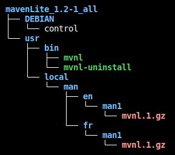

# Deployement d'une application sur APT

## Règles

- "`Saisie utilisateur`"
- '`Elément cliquable/sélectionnable`'
- `Nom de fichier, dossier ou autre`
- <Élément à remplacer>

> lien, raccourci clavier et phrase de demande de saisie

```txt
commande, extrait code et extrait de fichier
```

<div style="page-break-after: always;"></div>

## Table des matières

***

- [Deployement d'une application sur APT](#deployement-dune-application-sur-apt)
  - [Règles](#règles)
  - [Table des matières](#table-des-matières)
  - [Préparation du projet](#préparation-du-projet)
    - [Création d'un fichier deb](#création-dun-fichier-deb)
  - [Déploiement du projet](#déploiement-du-projet)

<div style="page-break-after: always;"></div>

## Préparation du projet

Vous devez tous d'abord créer un fichier deb pour votre projet. Pour cela vous devez suivre les étapes de [création d'un fichier deb](#création-dun-fichier-deb).

### Création d'un fichier deb

- Tutoriel source
  ><https://www.iodigital.com/nl/history/intracto/creating-debianubuntu-deb-packages>
- Créer un dossier pour le projet

  ```shell
  mkdir <nom_du_projet>
  ```

- Créer un dossier `DEBIAN` dans le dossier du projet

  ```shell
  mkdir <nom_du_projet>/DEBIAN
  ```

- Créer un fichier `control` dans le dossier `DEBIAN`

  ```shell
  touch <nom_du_projet>/DEBIAN/control
  ```

- Ouvrir le fichier `control` avec un éditeur de texte

  ```shell
  code <nom_du_projet>/DEBIAN/control
  ```

- Ajouter les informations suivantes dans le fichier `control`

  ```shell
  Package: <nom_du_projet>
  Version: <version_du_projet>
  Architecture: all <(ou amd64, arm64, i386, ...)>
  Depends: <dépendance_1>, <dépendance_2>, ...
  Maintainer: <nom_de_l\'auteur>
  Description: <description_du_projet>
  ```

- Copier les fichiers du projet dans le dossier du projet.
  - Veillez à bien copier les fichiers dans le dossier du projet et non dans le dossier `DEBIAN`
  - Créer les dossiers nécessaires dans le dossier du projet, par exemple si vous voulez créer une commande `mvnl` il faut que le fichier de commande est pour nom `mvnl` et qu'il soit dans le dossier `/usr/bin/`. Donc il faut créer le dossier `/usr/bin/` dans le dossier du projet et y mettre le fichier `mvnl`. Ceci est du au fait que quand le fichier deb sera installer, les fichiers seront copier dans le système de fichier de l'ordinateur en respectant l'arborescence du dossier du projet.
- Exemple d'arborescence de dossier du projet

  

- Créer le fichier deb

  ```shell
  dpkg-deb --build <nom_du_projet>
  ```

## Déploiement du projet
