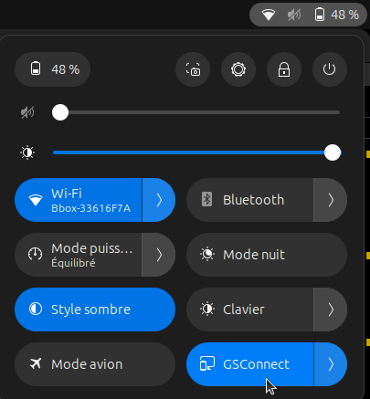

# Documentation de Gnome Shell Connect (GSConnect)

<a href="https://florobart.github.io/Documentations/"><button type="button">Retour à toute les documentations</button></a>

## Règles

- "`Saisie utilisateur`"
- '`Elément cliquable/sélectionnable`'
- `Nom de fichier, dossier ou autre`
- <Élément à remplacer>

> lien, raccourci clavier et phrase de demande de saisie

```txt
commande, extrait code et extrait de fichier
```

<div class="page"></div>

## Table des matières

****

- [Documentation de Gnome Shell Connect (GSConnect)](#documentation-de-gnome-shell-connect-gsconnect)
  - [Règles](#règles)
  - [Table des matières](#table-des-matières)
  - [Description de GSConnect](#description-de-gsconnect)
  - [Installation de GSConnect](#installation-de-gsconnect)

<div class="page"></div>

## Description de GSConnect

GSConnect est une extension pour Gnome Shell qui permet de connecter un smartphone Android à un ordinateur sous Gnome. Elle permet de synchroniser les notifications, les messages, les appels, les fichiers, la copie de texte, le partage de liens, le partage de fichiers, le contrôle multimédia, le contrôle de la souris et du clavier, le partage de la connexion internet, de faire sonner le téléphone et bien plus encore.

## Installation de GSConnect

- Source
  > <https://askubuntu.com/questions/1036351/how-to-install-and-run-gsconnect-to-have-android-integration-transfer-files-se>

- Installer le paquet `gnome-shell-extensions` du dépot `apt`, qui permet de voir les extensions installées :

  ```shell
  sudo apt install gnome-shell-extensions
  ```

- Installer l'extension `chrome-gnome-shell` du dépot `apt`, qui permet de gérer les extensions Gnome Shell depuis le navigateur :

  ```shell
  sudo apt install chrome-gnome-shell
  ```

- Installer l'extension chrome (ou firefox) GSConnect disponible sur le [Chrome Web Store](https://chromewebstore.google.com/detail/gsconnect/jfnifeihccihocjbfcfhicmmgpjicaec?hl=fr&utm_source=ext_sidebar)
- Aller sur la page de l'extention `GSConnect` sur le site de Gnome à l'adresse suivante :
  > <https://extensions.gnome.org/extension/1319/gsconnect/>
- Cliquer sur le bouton `Installer` pour installer l'extension
- Installer l'application `KDE Connect` sur le smartphone Android depuis le [Google Play Store](https://play.google.com/store/search?q=kde+connect&c=apps&hl=fr)
- Assurez-vous que le smartphone et l'ordinateur sont connectés au même réseau
- Assurez-vous que l'extension est activée dans les paramètres de Gnome Shell

  

- Ouvrir l'application `KDE Connect` sur le smartphone
- Cliquer sur le nom de l'ordinateur dans la liste des appareils disponibles
  - Si l'ordinateur n'apparait pas, cliquer sur le bouton `+` en haut à droite de l'application et entrer l'adresse IP de l'ordinateur

<br />

- Noter qu'après la première connexion, l'ordinateur et le smartphone se connecteront automatiquement lorsqu'ils seront sur le même réseau

****

<a href="https://florobart.github.io/Documentations/"><button type="button">Retour à toute les documentations</button></a>
