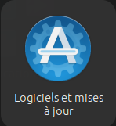
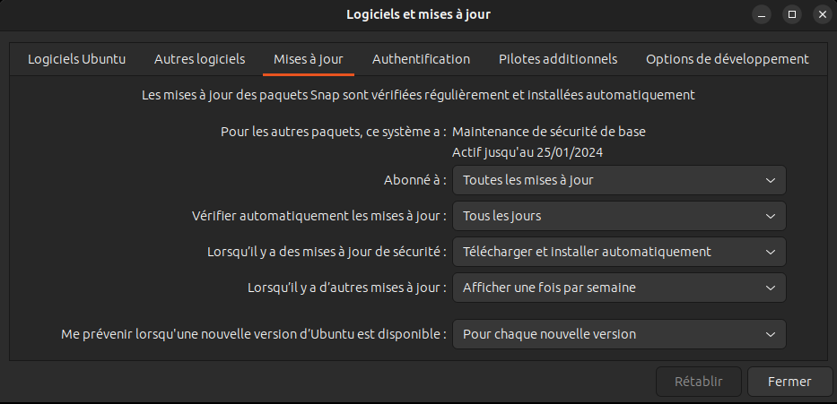
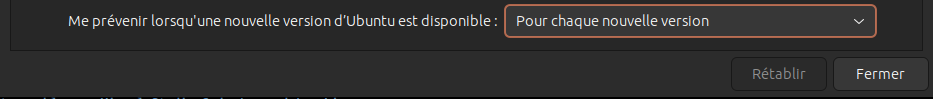
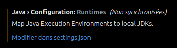

# Documentation d'installation et de configuration de différents logiciels et explications de manipulations diverses

<a href="https://florobart.github.io/Documentations/"><button type="button">Retour à toute les documentations</button></a>

## Règles

- "`Saisie utilisateur`"
- '`Elément cliquable/sélectionnable`'
- `Nom de fichier, dossier ou autre`
- <Élément à remplacer>

> lien, raccourci clavier et phrase de demande de saisie

```txt
commande, extrait code et extrait de fichier
```

<div class="page"></div>

## Table des matières

****

- [Documentation d'installation et de configuration de différents logiciels et explications de manipulations diverses](#documentation-dinstallation-et-de-configuration-de-différents-logiciels-et-explications-de-manipulations-diverses)
  - [Règles](#règles)
  - [Table des matières](#table-des-matières)
  - [Manipulations diverses](#manipulations-diverses)
    - [Réinitialiser une clé USB ou un disque dur](#réinitialiser-une-clé-usb-ou-un-disque-dur)
    - [Allouée la partition grace à GParted](#allouée-la-partition-grace-à-gparted)
    - [Changer le point de montage de la partition Windows sous Ubuntu desktop 22.04 LTS, 23.04 et 23.10](#changer-le-point-de-montage-de-la-partition-windows-sous-ubuntu-desktop-2204-lts-2304-et-2310)
    - [Monter uniquement un dossier](#monter-uniquement-un-dossier)
    - [Exécuter un script shell au démarrage d'Ubuntu 22.04 ou supérieur](#exécuter-un-script-shell-au-démarrage-dubuntu-2204-ou-supérieur)
      - [Exécuter le script en tant que super administrateur (pour les commandes sudo)](#exécuter-le-script-en-tant-que-super-administrateur-pour-les-commandes-sudo)
      - [Exécuter le script en tant que l'utilisateur de la session en cours d'utilisation](#exécuter-le-script-en-tant-que-lutilisateur-de-la-session-en-cours-dutilisation)
    - [Mettre à jour Ubuntu 23.04 Lunar Lobster vers Ubuntu 23.10 Mantic Minotaur](#mettre-à-jour-ubuntu-2304-lunar-lobster-vers-ubuntu-2310-mantic-minotaur)
    - [Réparer l'erreur de JDK introuvable sur Visual Studio Code (vs code) - Linux](#réparer-lerreur-de-jdk-introuvable-sur-visual-studio-code-vs-code---linux)
    - [Réinstallation de l'envirronement graphique de Ubuntu (gnome)](#réinstallation-de-lenvirronement-graphique-de-ubuntu-gnome)
    - [Mode Terminal de Ubuntu](#mode-terminal-de-ubuntu)
    - [Header et footer de l'extension `Markdown PDF` de vs code](#header-et-footer-de-lextension-markdown-pdf-de-vs-code)
    - [Modifier l'action du click sur une l'icone de l'application](#modifier-laction-du-click-sur-une-licone-de-lapplication)
      - [Avec le terminal](#avec-le-terminal)
      - [Avec une application tierce](#avec-une-application-tierce)
    - [Désinstallation de fichier deb](#désinstallation-de-fichier-deb)
    - [Création d'un fichier deb](#création-dun-fichier-deb)
    - [Création de pages de manuel - Linux](#création-de-pages-de-manuel---linux)
    - [Réinstallation de windows à partir d'une image système](#réinstallation-de-windows-à-partir-dune-image-système)
      - [Création d'une image de la partition windows](#création-dune-image-de-la-partition-windows)
      - [Réinstallation de windows](#réinstallation-de-windows)
    - [Utilisation d'applications Windows sur Ubuntu](#utilisation-dapplications-windows-sur-ubuntu)
    - [Mise en place de l'accès à phpmyadmin sur tout les appareils d'un réseau local](#mise-en-place-de-laccès-à-phpmyadmin-sur-tout-les-appareils-dun-réseau-local)
    - [Rendre la serveur laravel accessible sur tout les appareils d'un réseau local](#rendre-la-serveur-laravel-accessible-sur-tout-les-appareils-dun-réseau-local)
    - [Mettre à jour snap store d'Ubuntu](#mettre-à-jour-snap-store-dubuntu)
  - [Exécution de logiciel Windows sur Linux](#exécution-de-logiciel-windows-sur-linux)
    - [Wine](#wine)
      - [Installation de Wine - Linux](#installation-de-wine---linux)
      - [configurer de Wine comme programme par défaut pour charger les applications Windows](#configurer-de-wine-comme-programme-par-défaut-pour-charger-les-applications-windows)
    - [Proton](#proton)
    - [PlayOnLinux](#playonlinux)
    - [Lutris](#lutris)
    - [Installation de League of Legends à l'aide de Lutris - Linux](#installation-de-league-of-legends-à-laide-de-lutris---linux)
      - [Prérequit](#prérequit)
      - [Installation de Wine](#installation-de-wine)
      - [Installtion de Lutris](#installtion-de-lutris)
  - [Problème avec le gestionnaire de paquets apt - Linux](#problème-avec-le-gestionnaire-de-paquets-apt---linux)

<div class="page"></div>

## Manipulations diverses

****

### Réinitialiser une clé USB ou un disque dur

**Supprimme toutes les données et toute les partitions de la clé USB**

- fermet tout les gestionnaires de fichiers et terminaux ouverts sur la clé USB.
- Ouvrez un terminal
- Passez en mode admin :

  ```shell
  sudo su
  ```

- Listez les lecteurs :

  ```shell
  fdisk -l
  ```

- Administrez le lecteur de votre choix :

  X est la lettre de la clé USB

  ```shell
  fdisk /dev/sdX
  ```

  dans mon cas :

  ```shell
  fdisk /dev/sda
  ```

- Supprimez toutes les partitions : "`d X`"

  X est le numéro de la partition, dans mon cas : "`d 1`" et "`d 2`"

- Créez une nouvelle partition : "`n`"
- Choisissez le type de partition : "`p`"
- Choisissez le numéro de la partition : "`1`"
- Choisissez le premier cylindre, laisser la valeur par defaut et appuyer sur entrer
- Choisissez le dernier cylindre, laisser la valeur par defaut et appuyer sur entrer
- Sauvegardez les modifications : "`w`"
- Quittez fdisk : "`q`"

Vous avez maintenant une clé USB vierge avec 1 partition non allouée

### Allouée la partition grace à GParted

- Ouvrez GParted
- Dans la liste déroulante en haut à droite, sélectionnez la clé USB
- Clique droit sur la partition non allouée
- Sélectionnez '`Nouvelle`'
- Dans 'Espace libre précédent (Mio)', entrez le minimum, dans mon cas "`1`"
- Laisser tout les autres champs par défaut
- Sélectionnez le système de fichier de votre choix, dans mon cas "`ext4`"
- Cliquez sur '`Ajouter`'

### Changer le point de montage de la partition Windows sous Ubuntu desktop 22.04 LTS, 23.04 et 23.10

- Récupérer le nom de la partition windows :

  ```shell
  sudo fdisk -l
  ```

  - Sortie de la commande :

    ```shell
    ...

    Périphérique       Début        Fin  Secteurs Taille Type
    /dev/nvme0n1p1      2048     309247    307200   150M Système EFI
    /dev/nvme0n1p2    309248     571391    262144   128M Réservé Microsoft
    /dev/nvme0n1p3    571392  629715869 629144478   300G Données de base Microsoft
    /dev/nvme0n1p4 629716992  632066047   2349056   1,1G Environnement de récupérati
    /dev/nvme0n1p5 632066048  962566143 330500096 157,6G Système de fichiers Linux
    /dev/nvme0n1p6 962566600  998334463  35767864  17,1G Environnement de récupérati
    /dev/nvme0n1p7 998334464 1000214527   1880064   918M Environnement de récupérati

    ...
    ```

- Démonter la partition windows qui se nomme dans mon cas `/dev/nvme0n1p3` mais ça peut être différent :

  ```shell
  sudo umount /dev/nvme0n1p3
  ```

- Créer le dossier dans lequel sera monté la partition :

  ```shell
  sudo mkdir /OS
  ```

- Donner les droits d'accès au dossier sinon la partition ne pourra pas être monté dans ce dossier :

  ```shell
  sudo chmod 777 /OS
  ```

- Vérifier que la partition peut être monté dans le dossier :

  ```shell
  sudo mount /dev/nvme0n1p3 /OS
  ```

  - Si cette opération à fonctionner, vous pouvez démonter la partition à nouveau puis passer à l'étape suivante

    ```shell
    sudo umount /dev/nvme0n1p3
    ```

- Copier le fichier `/etc/fstab` dans le dossier `/etc/fstab_sauvegarde` :

  ```shell
  sudo cp /etc/fstab /etc/fstab_sauvegarde
  ```

- Ajouter ces lignes au fichier `/etc/fstab` :

  ```shell
  # Montage de la partition Windows
  /dev/nvme0n1p3	/OS	ntfs3	rw,user,auto,exec,gid=1000,uid=1000,umask=002, utf8,codepage=850,shortname=mixed	0	0
  ```

  - Chaque champs est séparé par une tabulation
  - "`# Montage de la partition Windows`" : commentaire optionnel
  - "`/dev/nvme0n1p3`" : nom de la partition
  - "`/OS`" : dossier dans lequel sera monté la partition
  - "`ntfs3`" : système de fichiers de la partition
  - "`rw,user,auto,exec,gid=1000,uid=1000,umask=002, utf8,codepage=850,shortname=mixed`" : options de montage
  - "`0`" : 0 pour ne pas faire de sauvegarde de la partition, 1 pour faire une sauvegarde de la partition
  - "`0`" : 0 pour ne pas vérifier la partition au démarrage, 1 pour vérifier la partition au démarrage

- Redémarrer l'ordinateur (cela peut prendre quelque minutes) :

  ```shell
  sudo reboot
  ```

### Monter uniquement un dossier

**Attention, un dossier peut être monter uniquement si la partition sur laquelle il se trouve est monté au préalable**

- Créer le dossier dans lequel sera monté le dossier :

  ```shell
  sudo mkdir /home/${USER}/<nom_du_dossier>
  ```

- Executer la commande suivant pour monter le dossier

  ```shell
  sudo mount --bind /<chemin_du_dossier_a_monte> /home/${USER}/<nom_du_dossier>
  ```

  - Dans mon cas

    ```shell
    sudo mount --bind /OS/Mon_Drive/ /home/${USER}/Mon_Drive/
    ```

### Exécuter un script shell au démarrage d'Ubuntu 22.04 ou supérieur

#### Exécuter le script en tant que super administrateur (pour les commandes sudo)

- Ouvrer le fichier `crontab` en administrateur grace à la commande suivante :

  ```shell
  sudo crontab -u root -e
  ```

- Si c'est la première fois que vous éditer ce fichier un choix d'éditeur vous sera demander. Choisissez celui que vous voulez mais je vous conseil fortement d'utiliser **`nano`** qui doit être en numéro **`1`**
- Ajouter la ligne suivante à la fin du fichier

  **Surtout n'utiliser pas de variable d'environnement comme `${USER}` parce qu'il est lancer en tant que root et que la variable ${USER} est vide lors de l'éxecution du script**

  ```shell
  @reboot /path/to/script.sh
  ```

  - Dans mon cas

    ```shell
    @reboot /home/floris/.scripts_on_boot/mount_mon_drive.sh
    ```

- Sauvegarder le fichier
  > Ctrl + X
- Confirmer la sauvegarde
- Ne modifier surtout pas pas le nom du fichier, appuyer sur entrer pour confirmer le nom qui entrer par défaut
- Redémarrer l'ordinateur pour vérifier que le script s'exécute bien au démarrage

  ```shell
  reboot
  ```

#### Exécuter le script en tant que l'utilisateur de la session en cours d'utilisation

- Ouvrer le fichier `crontab` grace à la commande suivante :

  ```shell
  crontab -e
  ```

- Si c'est la première fois que vous éditer ce fichier un choix d'éditeur vous sera demander. Choisissez celui que vous voulez mais je vous conseil fortement d'utiliser **`nano`** qui doit être en numéro **`1`**
- Ajouter la ligne suivante à la fin du fichier

  ```shell
  @reboot /path/to/script.sh
  ```

- Sauvegarder le fichier
  > Ctrl + X
- Confirmer la sauvegarde
- Ne modifier surtout pas pas le nom du fichier, appuyer sur entrer pour confirmer le nom qui entrer par défaut
- Redémarrer l'ordinateur pour vérifier que le script s'exécute bien au démarrage

  ```shell
  reboot
  ```

### Mettre à jour Ubuntu 23.04 Lunar Lobster vers Ubuntu 23.10 Mantic Minotaur

- Vérifier que vous êtes bien sur Ubuntu 23.04 grâce à la commande suivante

  **Il peut être nécessaire de l'installer (via le packet apt neofetch)**

  ```shell
  neofetch
  ```

  - Vous pouvez voir dans la sortie de la commande qu'en face de `OS` il y a écrit `Ubuntu 23.04` avec l'architecture de votre système, dans mon cas `x86_64`

    ```shell
                .-/+oossssoo+/-.               floris@floris-Inspiron-5402 
            `:+ssssssssssssssssss+:`           --------------------------- 
          -+ssssssssssssssssssyyssss+-         OS: Ubuntu 23.04 x86_64 
        .ossssssssssssssssssdMMMNysssso.       Host: Inspiron 5402 
       /ssssssssssshdmmNNmmyNMMMMhssssss/      Kernel: 6.2.0-34-generic 
      +ssssssssshmydMMMMMMMNddddyssssssss+     Uptime: 16 hours, 5 mins 
     /sssssssshNMMMyhhyyyyhmNMMMNhssssssss/    Packages: 1893 (dpkg), 15 (snap) 
    .ssssssssdMMMNhsssssssssshNMMMdssssssss.   Shell: bash 5.2.15 
    +sssshhhyNMMNyssssssssssssyNMMMysssssss+   Resolution: 3840x2160 
    ossyNMMMNyMMhsssssssssssssshmmmhssssssso   DE: GNOME 44.3 
    ossyNMMMNyMMhsssssssssssssshmmmhssssssso   WM: Mutter 
    +sssshhhyNMMNyssssssssssssyNMMMysssssss+   WM Theme: Adwaita 
    .ssssssssdMMMNhsssssssssshNMMMdssssssss.   Theme: Yaru-dark [GTK2/3] 
     /sssssssshNMMMyhhyyyyhdNMMMNhssssssss/    Icons: Yaru [GTK2/3] 
      +sssssssssdmydMMMMMMMMddddyssssssss+     Terminal: gnome-terminal 
       /ssssssssssshdmNNNNmyNMMMMhssssss/      CPU: 11th Gen Intel i7-1165G7 (8) @ 4.700GHz 
        .ossssssssssssssssssdMMMNysssso.       GPU: Intel TigerLake-LP GT2 [Iris Xe Graphics] 
          -+sssssssssssssssssyyyssss+-         Memory: 4175MiB / 15712MiB 
            `:+ssssssssssssssssss+:`
                .-/+oossssoo+/-.
    ```

- Ouvrez le logiciel `Logiciels et mise à jour` (en anglais `Software & Updates`)

  

- Allez dans l'onglet '`Mise à jour`'

  

- Changer la valeur de '`Me prévenir lorsqu'une nouvelle version d'Ubuntu est disponible`' en '`Pour chaque nouvelle version`'

  

- Fermer le logiciel de mise à jour
- Ouvrer un terminal
- Exécuter la commande suivante pour chercher les mises à jour de paquet à faire :

  ```shell
  sudo apt update
  ```

- Exécuter la commande suivante pour mettre à jour les paquets :

  ```shell
  sudo apt upgrade
  ```

- Ouvrer le fichier `/etc/update-manager/release-upgrades` avec un éditeur de texte :

  ```shell
  code /etc/update-manager/release-upgrades
  ```

  - Vérifier que la dernière ligne est la même que celle ci-dessous et que la valeur de `Prompt` est bien `normal`, si se n'est pas le cas modifier votre fichier
  - Résultat attendu :

    ```shell
    # Default behavior for the release upgrader.

    [DEFAULT]
    # Default prompting and upgrade behavior, valid options:
    #
    #  never  - Never check for, or allow upgrading to, a new release.
    #  normal - Check to see if a new release is available.  If more than one new
    #           release is found, the release upgrader will attempt to upgrade to
    #           the supported release that immediately succeeds the
    #           currently-running release.
    #  lts    - Check to see if a new LTS release is available.  The upgrader
    #           will attempt to upgrade to the first LTS release available after
    #           the currently-running one.  Note that if this option is used and
    #           the currently-running release is not itself an LTS release the
    #           upgrader will assume prompt was meant to be normal.
    Prompt=normal

    ```

- Vous pouvez maintenant fermer l'éditeur de texte
- Vous pouvez maintenant forcer le processus de mise à jour dans le terminal grâce à la commande suivante :

  ```shell
  sudo do-release-upgrade
  ```

- Si il vous affiche '`No new release found`' il existe deux solution :
  - Réessayer la commande `sudo do-release-upgrade` avec l'option `-d` :

    ```shell
    sudo do-release-upgrade -d
    ```
  
  - Sinon attendez quelque jour puis recommencer. Cela peux être du au fait que votre ordinateur n'est pas supporter par la nouvelle la version 23.10 de Ubuntu

### Réparer l'erreur de JDK introuvable sur Visual Studio Code (vs code) - Linux

- Éditer le fichier `.bashrc` :

  ```shell
  code /home/${USER}/.bashrc
  ```

- Ajouter les lignes suivantes à la fin du fichier `.bashrc` :
  - Dans mon cas le chemin vers le JDK est `/usr/lib/jvm/java-17-openjdk-amd64`

  ```shell
  # Ajout de la variable JAVA_HOME pour vs code
  export JAVA_HOME='<path to jdk>'
  export PATH="${PATH}:${JAVA_HOME}/bin"
  ```

- Mettre à jour le fichier `.bashrc` :

  ```shell
  source /home/${USER}/.bashrc
  ```

- Fermer puis réouvrir vs code
- Aller dans les paramètres de vs code
- Rechercher "`java runtime`"
- Vous devrier voir '`Java › Configuration: Runtimes`'
- Cliquer sur '`Modifier dans setting.json`'

  

- Ajouter la valeur de java home dans le fichier `settings.json` comme montrer ci-dessous :

  ```json
    ...
    "git.autofetch": true,
    "git.confirmSync": false,
    "workbench.colorTheme": "GitHub Dark Perso",
    "java.jdt.ls.java.home": "<add JAVA_HOME here>",
    "explorer.confirmDelete": false,
      "java.configuration.runtimes": [
        {
          "name": "JavaSE-17",
          "path": "<add JAVA_HOME here>",
          "default": true
        }
      ],
      "diffEditor.ignoreTrimWhitespace": false,
      ...
  ```

  - Dans mon cas :

    ```json
      ...
      "git.autofetch": true,
      "git.confirmSync": false,
      "workbench.colorTheme": "GitHub Dark Perso",
      "java.jdt.ls.java.home": "/usr/lib/jvm/java-17-openjdk-amd64",
      "explorer.confirmDelete": false,
        "java.configuration.runtimes": [
          {
            "name": "JavaSE-17",
            "path": "/usr/lib/jvm/java-17-openjdk-amd64",
            "default": true
          }
        ],
        "diffEditor.ignoreTrimWhitespace": false,
        ...
    ```

### Réinstallation de l'envirronement graphique de Ubuntu (gnome)

- pour réinstaller l'envirronement graphique lancer la commande

  ```shell
  sudo apt-get install --reinstall ubuntu-desktop
  ```

- redémarer l'ordinateur

  ```shell
  reboot
  ```

### Mode Terminal de Ubuntu

- Pour ouvrir le mode terminal d'ubuntu
  > Ctrl + Alt + F3
- Pour quitter le mode terminal d'ubuntu
  > Alt + F2

### Header et footer de l'extension `Markdown PDF` de vs code

- Header

  ```html
  <div style="font-size: 9px; margin-left: 1cm;"><span class='title'></span> - Floris Robart</div>  <div style="font-size: 9px; margin-left: auto; margin-right: 1cm; ">%%ISO-DATE%%</div>
  ```

- Footer

  ```html
  <div style="font-size: 9px; margin-left: auto; margin-right: auto; margin-bottom: -8px;"> <span style="font-size: 9px" class='pageNumber'></span> / <span class='totalPages'></span></div>
  ```

### Modifier l'action du click sur une l'icone de l'application

#### Avec le terminal

- Ouvrez un terminal

  ```sh
  gsettings set org.gnome.shell.extensions.dash-to-dock click-action 'minimize-or-previews'
  ```

#### Avec une application tierce

- Installer `Dconf-Editor`
- Allez dans `/org/gnome/shell/extensions/dash-to-dock`
- Cliquez sur '`click-action`'
- Décochez la case '`Utiliser la valeur par défaut`'
- Sélectionnez l'option que vous voulez, dans mon cas '`minimize-or-previews`'

### Désinstallation de fichier deb

- source
  ><https://www.baeldung.com/linux/apt-uninstall-dpkg-deb-package>
- Pour désinstaller un fichier deb, il faut utiliser la commande `dpkg` avec l'option `-r` ou `--remove` :

  ```shell
  sudo dpkg -r <nom_du_fichier_deb>
  ```

- Pour désinstaller et supprimer tout les fichiers de configuration d'un fichier deb, il faut utiliser la commande `dpkg` avec l'option `--purge` :

  ```shell
  sudo dpkg --purge <nom_du_fichier_deb>
  ```

### Création d'un fichier deb

- Tutoriel source
  ><https://www.iodigital.com/nl/history/intracto/creating-debianubuntu-deb-packages>
- Créer un dossier pour le projet

  ```shell
  mkdir <nom_du_projet>
  ```

- Créer un dossier `DEBIAN` dans le dossier du projet

  ```shell
  mkdir <nom_du_projet>/DEBIAN
  ```

- Créer un fichier `control` dans le dossier `DEBIAN`

  ```shell
  touch <nom_du_projet>/DEBIAN/control
  ```

- Ouvrir le fichier `control` avec un éditeur de texte

  ```shell
  code <nom_du_projet>/DEBIAN/control
  ```

- Ajouter les informations suivantes dans le fichier `control`

  ```shell
  Package: <nom_du_projet>
  Version: <version_du_projet>
  Architecture: all <(ou amd64, arm64, i386, ...)>
  Depends: <dépendance_1>, <dépendance_2>, ...
  Maintainer: <nom_de_l\'auteur>
  Description: <description_du_projet>
  ```

- Copier les fichiers du projet dans le dossier du projet.
  - Veillez à bien copier les fichiers dans le dossier du projet et non dans le dossier `DEBIAN`
  - Créer les dossiers nécessaires dans le dossier du projet, par exemple si vous voulez créer une commande `mvnl` il faut que le fichier de commande est pour nom `mvnl` et qu'il soit dans le dossier `/usr/bin/`. Donc il faut créer le dossier `/usr/bin/` dans le dossier du projet et y mettre le fichier `mvnl`. Ceci est du au fait que quand le fichier deb sera installer, les fichiers seront copier dans le système de fichier de l'ordinateur en respectant l'arborescence du dossier du projet.
- Exemple d'arborescence de dossier du projet

  

- Créer le fichier deb

  ```shell
  dpkg-deb --build <nom_du_projet>
  ```

### Création de pages de manuel - Linux

- Tutoriel source
  ><https://www.cyberciti.biz/faq/linux-unix-creating-a-manpage/>
- [Installer le paquet `txt2man`](#installation-de-txt2man---linux)
- Créer un fichier texte ou markdown avec les informations de la page de manuel
  - Exemple de fichier markdown avec Maven Lite
    - Les titres de niveau 1 sont obligatoires. Ce sont des conventions des pages de manuel.

    ```md
    ---
    date: Janvier 2024
    section: 1
    title: Maven Lite
    ---

    # NOM

    mvnl - Gestionnaire de projet Java simple et léger inspiré du gestionnaire de projet `Maven`.

    # SYNOPSIS

    mvnl \[OPTION\]\... \[ARGUMENT\]\...

    # DESCRIPTION

    description du programme

    # EXEMPLES

    -   `mvnl -s src -o bin -c -e UTF-8` \--\> compile le projet Java avec
        l\'encodage UTF-8 qui se trouve dans le dossier src et met les
        fichiers compilés dans le dossier bin.

    # COMPORTEMENT PAR DÉFAUT

    Par défaut, si aucune option n\'est spécifiée, la commande `mvnl`
    affiche la page d\'aide qui est affichée avec l\'option `-h` ou
    `--help`. Cette page d\'aide est différente et plus simple que la page
    de manuel qui est affichée avec la commande `man mvnl`.

    # OPTIONS

    ## Toutes les options

    -v , \--version Affiche la version et quitter.

    -h , \--help Affiche l\'aide et quitter.

    ## Les options obligatoires pour la compilation sont :

    -s , \--source Dossier racine du projet à compiler.

    -o , \--output Dossier de sortie des fichiers compilés.

    -c , \--compilation Compile le projet.

    ## Les options obligatoires pour le lancement sont :

    -m , \--main Classe principale à lancer.

    -l , \--launch Lance le projet.

    -cp , \--classpath Voir l\'option -cp dans la liste des options
    ci-dessus.

    ## Les options obligatoires pour la compilation et le lancement sont :

    -s , \--source Dossier racine du projet à compiler.

    -o , \--output Dossier de sortie des fichiers compilés.

    -m , \--main Classe principale à lancer.

    -cl , \--compile-launch Compile et lance le projet. (équivalent à -c -l)

    # CODES DE RETOUR

    0 : Tout s\'est bien passé.

    1 : Une erreur est survenue.

    # FICHIERS

    Maven Lite est constitué uniquement de 3 fichiers.

    -   `'mvnl'`, le fichier principal qui se situe dans le dossier
        \'/usr/bin/\'.

    -   `'mvnl.1.gz'`, le fichier d\'aide contenant la page de manuel française
        affichée avec la commande `man mvnl` qui se situe dans le dossier
        `'/usr/local/man/fr/man1/'`.

    -   `'mvnl.1.gz'`, le fichier d\'aide contenant la page de manuel anglaise
        affichée avec la commande `man mvnl` qui se situe dans le dossier
        `'/usr/local/man/en/man1/'`.

    # BOGUES

    Bogues connu

    # AUTEUR

    Écrit par Robart Floris.

    # RAPPORT DE BOGUES

    Reporter les bogues par mail à l\'adresse \<email@gmail.com\>
    ```

- Convertissez votre fichier en fichier Roff

  ```shell
  txt2man -t <nom_du_fichier> > <nom_du_fichier>.1
  ```

  ```shell
  pandoc ‐-from markdown ‐-to roff <nom_fichier_source> -o <nom_fichier_destination>.1
  ```

- Il peut être nécessaire d'ajouter la ligne suivante au début votre fichier `.1`

  ```roff
  .TH "<Nom>" "<section>" "<Date>" "<Nom> Version <version format X.X.X>" "<type de l'application>"
  ```

  - Exemple avec Maven Lite

    ```roff
    .TH "Maven Lite" "1" "Janvier 2024" "Maven Lite Version 1.2.0" "Commandes Utilisateur"
    ```

- Convertissez votre fichier `Roff` en fichier conpresser `.1.gz`.
  - Attention, le nom du fichier `.1.gz` doit obligatoirement être le nom de la commande que vous avez créer. Dans mon cas le nom de la commande est `mvnl` donc le nom du fichier `.1.gz` doit être `mvnl.1.gz`

  ```shell
  gzip <nom_du_fichier>.1 > <nom_du_fichier>.1.gz
  ```

- Pour que la commande `man` fonctionne il faut placer le fichier `.1.gz` dans le dossier `/usr/local/man/<langue>/man1/`.

  ```shell
  sudo cp mvnl.1.gz /usr/local/man/fr/man1/mvnl.1.gz
  ```

### Réinstallation de windows à partir d'une image système

La réinstallation de windows à partir d'une image système permet de réinstaller windows sans perdre les données de la partition windows. Cette action est très longue, il faut compter plusieurs heures.

#### Création d'une image de la partition windows

- Ouvrir le logiciel `Panneau de configuration`
- Aller dans `Système et sécurité` > `Sauvegarder et restaurer (Windows 7)`
- Cliquer sur `Créer une image système`
- Sélectionner le disque dur sur lequel vous voulez créer l'image système
- Cliquer sur `Suivant`
- Patienter pendant la création de l'image système, cela peut prendre entre 30 minutes et 2 heures (environs)

#### Réinstallation de windows

- Boot sur la clé USB Ventoy
- Sélectionner le dossier correspondant à Windows
- Sélectionner les information de langage suivant :
  - Langue à installer : '`Français (France)`'
  - Format horaire et monétaire : '`Français (France)`'
  - Clavier ou méthode d'entré : '`Français`'
- Cliquer sur '`Suivant`'
- Au moment de l'installation cliquer sur '`Réparer l'ordinateur`'
- Cliquer sur '`Dépannage`'
- Cliquer sur '`Récupération de l'image système`'
- Cliquez sur votre image, normalement il y en a qu'une
- Sélectionner '`utiliser la dernière image système (recommendé)`'
- Cliquer sur '`Suivant`'
- Sélectionner '`Formater et répartionner les disques`'
- **Attention très important**
  - Sélectionner les disques à exclure de la réinstallation de windows, dans mon cas j'ai sélectionner tout les disques sauf celui sur lequel je veux réinstaller windows
- Cliquer sur '`Suivant`'
- Laisser les options `Date et heure`, `Ordinateur` et `Lecteurs à restaurer` par défaut
- Cliquer sur '`Terminer`'
- Confirmer la réinstallation de windows en cliquant sur '`Oui`'
- Patienter pendant la réinstallation de windows, cela est très long (plusieurs heures)
- de retour sur l'affichage de ventoy, redémarrer l'ordinateur

### Utilisation d'applications Windows sur Ubuntu

- Installer et configurer `Wine`
- Installer l'exécutable de l'application Windows
- Lancer l'exécutable avec `Wine`

  ```shell
  wine <nom_du_fichier>.exe
  ```

- Vous pouvez maintenant utiliser l'application Windows sur Ubuntu

### Mise en place de l'accès à phpmyadmin sur tout les appareils d'un réseau local

- Ouvrez le fichier `/opt/lampp/etc/extra/httpd-xampp.conf` avec un éditeur de texte en administrateur

  ```shell
  sudo open /opt/lampp/etc/extra/httpd-xampp.conf
  ```

- Remplacez la ligne "`Require local`" par "`Require all granted`" comment indiqué ci-dessous

  ```conf
  <Directory "/opt/lampp/phpmyadmin">
      AllowOverride AuthConfig Limit
      Require all granted
      ErrorDocument 403 /error/XAMPP_FORBIDDEN.html.var
  </Directory>
  ```

- Sauvegardez le fichier
- Rechargez le serveur Apache en utilisant l'inteface graphique de XAMPP

### Rendre la serveur laravel accessible sur tout les appareils d'un réseau local

- Lancer le serveur laravel avec la commande suivante

  ```shell
  php artisan serve --host=0.0.0.0 --port=8000
  ```

- Récupérer l'adresse IP ou le nom de la machine sur laquel le serveur laravel est lancé

  - Récupérer l'adresse IP sous Linux

    ```shell
    hostname -I
    ```
  
  - Récupérer le nom de la machine sous Linux

    ```shell
    hostname
    ```

  - Récupérer l'adresse IP sous Windows

    ```shell
    ipconfig
    ```
  
  - Récupérer l'adresse IP sous Windows grâce à l'inteface graphique
    - <https://support.microsoft.com/en-us/windows/find-your-ip-address-in-windows-f21a9bbc-c582-55cd-35e0-73431160a1b9>

- Ouvrir un navigateur sur un autre appareil connecté au même réseau
- Entrer l'adresse IP de la machine sur lequel le serveur laravel est lancé suivi du numéro de port, en l'occurence "`:8000`"

  ```shell
  <adresse_ip>:8000
  ```

  OU

  ```shell
  <nom>:8000
  ```

  - En règle général l'adresse IP est de la forme `192.168.1.XX`

    ```shell
    192.168.1.XX:8000
    ```

### Mettre à jour snap store d'Ubuntu

```shell
snap-store --quit && sudo snap refresh snap-store
```

<div class="page"></div>

## Exécution de logiciel Windows sur Linux

****

Pour exécuter des logiciels Windows sur Linux il existe plusieurs solutions

- Wine
- Lutris
- Proton
- PlayOnLinux

### Wine

Wine est un logiciel qui permet de traduire les appels systèmes de Windows en appels systèmes POSIX, permettant ainsi d'exécuter des applications Windows sous Linux.

Il est fortement recommandé parce qu'il est très efficace, stable et permet d'exécuter des logiciels Windows et pas uniquement des jeux. Il est plus difficile à configurer que Proton mais il est plus stable et permet d'exécuter des logiciels non Steam de façon plus sure.

#### Installation de Wine - Linux

- Installer le paquet `wine` depuis le dépot `apt`

  ```shell
  sudo apt install wine
  ```

- Installer le paquet `wine32` depuis le dépot `apt` ainsi que l'architecture 32 bits `i386`
  - Ce paquet est nécessaire pour le bon fonctionnement de wine, même si vous avez un système 64 bits et n'utiliser que des applications 64 bits

  ```shell
  sudo dpkg --add-architecture i386 && sudo apt-get update && sudo apt-get install wine32:i386
  ```

- Tester le bon fonctionnement de wine en installant le logiciel `notepad++` :
  - Télécharger le fichier d'installation de notepad++

    ```shell
    wget https://github.com/notepad-plus-plus/notepad-plus-plus/releases/download/v8/npp.8.0.Installer.x64.exe
    ```

  - Installer notepad++ avec wine

    ```shell
    wine npp.8.0.Installer.x64.exe
    ```

  - Suiver les instructions d'installation de notepad++
  - Créer un raccourci de notepad++ sur le bureau
  - Pour que le raccourci fonctionne, il faut faire clique droit dessus > '`Autoriser l'exécution`'

#### configurer de Wine comme programme par défaut pour charger les applications Windows

- Créer un lien symbolique de `wine.desktop` dans le dossier `/usr/share/applications` :

  ```shell
  sudo ln -s /usr/share/doc/wine/examples/wine.desktop /usr/share/applications
  ```

- Faite un clique droit sur l'application Windows que vous voulez lancer > Ouvrir avec > Autre application > Wine - Chargeur de programmes Windows
  - Penser à bien cocher la case '`Toujours utiliser pour ce type de fichier`'
- Vous pouvez maintenant lancer l'application Windows en double cliquant dessus

### Proton

Proton est un outil de compatibilité pour exécuter des jeux Windows sur Linux via Steam. Proton est développé par Valve et basé sur Wine et d'autres composants.

Proton est très efficace et stable mais permet uniquement d'exécuter des jeux Steam. Il est tout de même possible d'exécuter des jeux non Steam avec Proton Expérimental mais cela n'est pas recommandé car c'est encore en développement et ne fonctionne pas toujours.

### PlayOnLinux

PlayOnLinux est un logiciel qui permet d'installer et d'utiliser facilement de nombreux jeux et logiciels conçus pour fonctionner exclusivement sous Windows.

### Lutris

Lutris est une plate-forme de jeu open source pour Linux. Il est conçu pour gérer l’installation et la configuration des jeux et pour fournir une interface unifiée pour jouer à des jeux à partir de plusieurs sources.

Lutris peut gérer des jeux provenant de diverses sources, notamment Steam, GOG et Humble Bundle. Il peut également gérer les installations de jeux personnalisées, par exemple à partir d'un fichier ISO.

### Installation de League of Legends à l'aide de Lutris - Linux

**L'installation de League of Legends à l'aide de Lutris n'a pas fonctionné pour moi, j'ai donc fini pas abandonner l'idée de jouer à League of Legends sur Linux**

- Installer lutris
- Installer wine
- Installer winetricks
- suivre les instructions d'installation de lutris
- Erreur, impossible de lancer le fichier `explorer.exe`

#### Prérequit

- Avoir les droits d'administration
- Vous n'avez même pas besoin d'installer Wine, Lutris s'en charge pour vous

#### Installation de Wine

- Installer le paquet du dépot `apt` :

  ```shell
  sudo apt install wine
  ```

#### Installtion de Lutris

- Installer le paquet du dépot `apt` :

  ```shell
  sudo apt install lutris
  ```

- Ouvrez Lutris
- Cliquer sur le bouton '`+`' en haut à gauche de la fenêtre
- Cliquer sur '`Rechercher des installateurs sur le site de Lutris`'
- Chercher "`League of Legends`"
- Cliquer sur '`League of Legends`' avec en dessous '`2009, Mac, Windows`'
- Cliquer sur '`Installer`'
- Cliquer sur '`Continuer`'
- Patienter pendant l'installation, cela peut prendre beaucoup de temps

- OSerror

## Problème avec le gestionnaire de paquets apt - Linux

- Si vous avez un problème avec le gestionnaire de paquets apt, lancer la commande :

  ```shell
  sudo apt --fix-broken install
  ```

****

<a href="https://florobart.github.io/Documentations/"><button type="button">Retour à toute les documentations</button></a>
