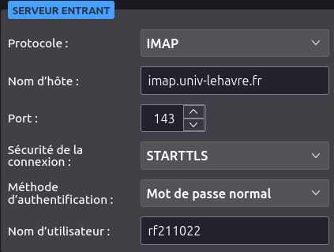
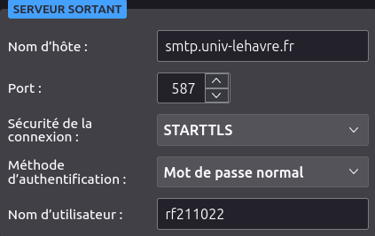

# Instalation et configuration de thunderbird pour l'IUT

<a href="https://florobart.github.io/Documentations/"><button type="button">Retour à toute les documentations</button></a>

## Règles

- "`Saisie utilisateur`"
- '`Elément cliquable/sélectionnable`'
- `Nom de fichier, dossier ou autre`
- <Élément à remplacer>

> lien, raccourci clavier et phrase de demande de saisie

```txt
commande, extrait code et extrait de fichier
```

<div class="page"></div>

## Table des matières

****

- [Instalation et configuration de thunderbird pour l'IUT](#instalation-et-configuration-de-thunderbird-pour-liut)
  - [Règles](#règles)
  - [Table des matières](#table-des-matières)
  - [Installation de thunderbird](#installation-de-thunderbird)
  - [Configuration de thunderbird pour l'IUT](#configuration-de-thunderbird-pour-liut)

<div class="page"></div>

## Installation de thunderbird

- Installer le paquet du dépot `apt` :

  ```shell
  sudo apt install thunderbird thunderbird-locale-fr
  ```

## Configuration de thunderbird pour l'IUT

Au premier lancemant de thunderbird, il faut configurer le compte mail.

- Remplir les champs suivants :
  - `Votre nom complet` : "`Prénom Nom`"
  - `Adresse e-mail` : "`Prénom.nom@etu.univ-lehavre.fr`"
  - `Mot de passe` : "`Mot de passe`"
- Cliquer sur `Continuer`
- Remplisser les champs du serveur entrant
  

- Remplisser les champs du serveur sortant
  

- Cliquer sur `Terminé`
- Cliquer à nouveau sur `Terminé`

****

<a href="https://florobart.github.io/Documentations/"><button type="button">Retour à toute les documentations</button></a>
